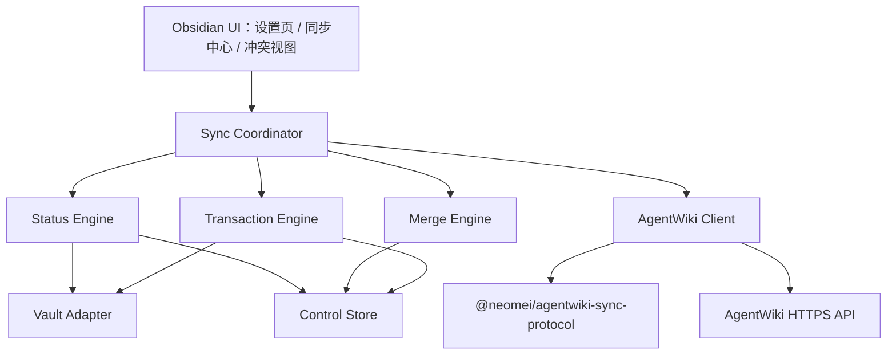

# AgentWiki Sync Obsidian 插件设计

## 文档状态

- 产品名称：`AgentWiki Sync`
- Obsidian 插件 ID：`agentwiki-sync`
- 设计确认日期：2026-08-13
- 状态：已完成第六轮可实现性复审与修订，等待用户最终确认
- 依赖契约：[`docs/contracts/agentwiki-obsidian-sync-api-v1.md`](../../contracts/agentwiki-obsidian-sync-api-v1.md)

## 1. 背景与目标

AgentWiki Sync 是独立发布、独立版本化的 Obsidian 社区插件。首版目标是让一个 Obsidian Vault 通过 AgentWiki 同步多个 Space，从而以 AgentWiki 替代传统公共 Vault 的多端共享方式。

首版交付一个可验证的手动同步闭环：

1. 用户在 Obsidian 设置页内以 AgentWiki 人类身份连接设备。
2. 一个 Vault 可以映射多个 AgentWiki Space，每个 Space 对应一个互不重叠的目录。
3. 用户通过 `Status`、`Pull`、`Push` 完成 Git 风格同步。
4. 所有本地写入和远端发布均先预览、后确认。
5. 同步同时支持 Obsidian 桌面端和移动端。

未来 Claudian 等 Agent 可以调用相同的同步用例，但不属于首版。未来 Agent 只能发起预览，不能读取设备凭据，也不能绕过 Obsidian 内的人类确认。

## 2. 首版范围

### 2.1 包含

- 一个 Vault 连接一个 AgentWiki 服务。
- 一个 Vault 映射多个 Space。
- 每个 Space 映射一个 Vault 相对目录。
- 映射目录互不相同、互不嵌套。
- 仅同步映射目录中 Obsidian Vault API 可见、扩展名按 ASCII 大小写不敏感等于 `.md` 的文件；保留实际路径大小写。
- 保留 Markdown 的嵌套相对目录结构。
- 提供设置页、功能区入口、同步中心、命令面板命令、预览和冲突解决界面。
- 提供首次绑定、Status、Pull、Push、可恢复删除、三方合并和事务回滚。
- 使用人类设备同步凭据，按当前用户和实时 Space 角色授权。
- 支持分页 Snapshot/Delta、分批上传和原子 finalize。
- 在单 Space 5,000 篇 Markdown、正文总计 100 MiB、单篇不超过 1 MiB 的基线下验收。
- 插件 v1 只绑定服务端固定 revision 的 pageCount ≤ 5,000、规范化正文总量 ≤ 100 MiB、revision manifest canonical bytes ≤ 4 MiB，且本地 Markdown 数/规范化正文总量/候选 manifest 同样不超限的 Space；AgentWiki 本身可容纳更大 Space，但插件显示不兼容诊断且不下载正文或同步。

### 2.2 不包含

- 图片、音频、视频、PDF、Canvas 或其他二进制附件同步。
- AgentWiki Relation、Memory、Source 或附件模型同步。
- 自动检查、定时轮询、自动 Pull 或自动 Push。
- Stage、Unstage、Commit、部分文件 Push 或一键同步全部 Space。
- 在 Markdown 中写入 AgentWiki page ID、Space ID 或其他同步 frontmatter。
- 将 YAML frontmatter 解释为同步元数据；frontmatter 作为正文原样同步。
- Claudian、MCP 或其他 Agent 的实际接入。
- 在当前仓库修改 AgentWiki 主项目。
- 在首版中支持一个 Vault 连接多个 AgentWiki 服务。

## 3. 核心产品决策

### 3.1 Space 与目录

- Space 是同步、版本、事务和冲突处理的最小边界。
- 一个 Vault 可以绑定多个 Space。
- 每个 Space 绑定一个 Vault 相对目录，例如 `Knowledge/Product/`。
- `rootPath` 必须是非空目录路径；首版不允许把 Vault 根目录本身映射给 Space。
- 未映射目录完全不参与扫描和同步。
- 两个映射目录不能相同或相互嵌套。
- 映射目录不能包含 Vault 根目录的 `.agentwiki/` 控制目录。
- `rootPath` 自身也必须是 NFC 规范化的可移植相对目录路径，适用第 3.4 节的非文件扩展名规则。映射重叠检查在 `pathKey(rootPath)` 上进行，不依赖当前设备文件系统是否大小写敏感。
- 首版不提供跨 Space 移动。把文件从一个映射目录移动到另一个映射目录，会在源 Space 中表现为归档、在目标 Space 中表现为新增，并分别预览确认。
- 跨 Space 的 Obsidian rename 事件不传递 page ID；源 Space 删除原 identity，目标 Space 生成新 UUID，避免一个公开 page ID 被静默迁移到另一 Space。

### 3.2 Git 风格操作

首版采用轻量 Git 语义：

- `Status`：计算本地变化并轻量检查远端 revision head。
- `Pull`：取得远端变化、三方合并、预览并原子应用到 Vault。
- `Push`：确认远端没有领先后，预览并条件式发布本地变化。

没有暂存区和本地 commit。一个 Space 映射目录内的所有可同步变化进入该 Space 的 Push 预览。

### 3.3 页面映射

对映射目录 `Knowledge/Product/` 下的 `Guides/Setup.md`：

- AgentWiki `path`：`Guides/Setup.md`
- AgentWiki `title`：`Setup`
- AgentWiki `body`：文件的完整 Markdown 字符串
- AgentWiki `pageId`：公开、稳定且不透明的 Knowledge ID；现有页面使用 AgentWiki `Page.knowledgeKey`，本地新增页面使用 UUID v4

正文不要求首行是 H1。为避免远端 title 无法在纯 Markdown 中无损表示，title 使用以下方向性规则：

- 本地新增页面时，title 取文件名 stem。
- 本地移动但文件名未变时，只更新 path，保留 base title。
- 本地重命名文件时，title 更新为新文件名 stem。
- 远端 title-only 变化写入 manifest，不改名本地文件；后续 body-only Push 保留 manifest 中的远端 title，不用文件名覆盖它。

因此，只有本地新增或文件名变化会从文件名派生 title。移动或重命名不会生成新的 page ID。

`Page.id` 是 AgentWiki 服务端内部数据库 ID，不得出现在同步协议中。公开 `pageId` 永远映射到 `Page.knowledgeKey`。本地新增页在第一次进入 Push 预览时生成 UUID v4；该 ID 与预览一起持久化，即使取消上传、网络重试或应用重启也保持不变，直到用户删除该本地新增文件或成功建立远端基线。

AgentWiki 必须为每个 Page 保存正式的 `syncPath` 与大小写无关的 `syncPathKey`。协议中的 `path` 对应 `syncPath`，不能再临时从 title、slug 或 sourcePath 推导。详细迁移和统一 revision 规则见上游 API 契约第 4–5 节。

### 3.4 文本规范化

- 传输编码为 UTF-8。
- 计算正文 hash、比较和上传前，将 `CRLF` 和单独的 `CR` 规范化为 `LF`。
- 是否包含末尾换行属于正文内容，必须保留在比较结果中。
- 正文不做 Unicode 归一化。
- 路径分隔符统一为 `/`，路径段进行 Unicode NFC 归一化。
- 为保证跨平台恢复，Status 必须拒绝 Unicode 归一化后重复或仅大小写不同的路径碰撞。
- 禁止绝对路径、空路径段、`.`、`..`、U+0000–U+001F、`< > : " / \\ | ? *` 和逃逸映射根目录的路径。
- 任一路径段不得以空格或句点结尾；路径段从开头到第一个 `.` 前的 Windows device basename 按 ASCII 大小写不敏感不得等于 `CON`、`PRN`、`AUX`、`NUL`、`COM1`–`COM9`、`LPT1`–`LPT9`、`COM¹`–`COM³` 或 `LPT¹`–`LPT³`。
- 每个 NFC 路径段的 UTF-8 编码最长 255 字节，完整相对路径的 UTF-8 编码最长 1,024 字节；标题最长 500 个 Unicode code point，规范化正文最长 1 MiB。
- 标题必须包含 1–500 个 Unicode code point，不允许 U+0000–U+001F。因此文件名恰为 `.md` 或其他导致空 stem 的本地文件属于阻塞性 `invalid`。
- 上述可移植路径规则同时由协议包、插件 Status/Pull 和服务端写入器执行。服务端不得接受一个只能在部分支持平台落盘的 syncPath。
- 目标文件路径不能已被文件夹占用，任何父路径也不能是普通文件；这些情况属于阻塞性 `invalid`。
- Pull 可以创建缺失父目录。回滚只删除本事务创建且仍为空的目录；普通空目录不参与同步，也不会因 Pull/Push 自动删除。

本地 Markdown 扫描使用 `Vault.readBinary()` 取得原始字节。首版明确拒绝开头为 `EF BB BF` 的 UTF-8 BOM，再用 `TextDecoder("utf-8", { fatal: true })` 解码；BOM 或非法 UTF-8 都是阻塞性 `invalid`，不得吞掉 BOM 或以 U+FFFD 替换后上传。这个约束保证回调中的字符串用 `TextEncoder` 重新编码后能与扫描 bytes 精确比较。协议 `contentHash` 始终对规范化正文求 hash；本地条件写入另用 `vaultByteHash = SHA-256(扫描时原始字节)`，使只改变 CRLF/LF 或其他原始字节的竞态也会使预览失效。

## 4. 架构



### 4.1 Obsidian UI 外壳

负责展示状态、收集选择和取得确认。UI 不直接发 HTTP、不直接写 Vault，也不直接修改 manifest。

### 4.2 Sync Coordinator

负责 Status、Pull、Push 和首次绑定的用例编排：

- 根据活动文件或用户选择确定 Space。
- 对同一 Space 获取排他操作锁。
- 调用状态、合并、事务和 API 端口。
- 在任何写入前生成不可变预览。
- 校验用户确认对应的预览 hash。
- 把结构化进度和错误返回 UI。

不同 Space 逻辑上彼此隔离。首版不主动并行执行多个 Space 操作。

### 4.3 Status Engine

纯 TypeScript 模块，负责：

- 比较当前文件、manifest 和 base。
- 分类新增、修改、删除、移动/重命名和身份歧义。
- 检测路径碰撞、超限文件和不支持的附件链接。
- 生成 Push 输入和 Pull 的本地分支。

### 4.4 Merge Engine

纯 TypeScript 模块，负责 page identity、路径、标题和正文的三方比较。正文使用 `node-diff3` 3.x 逐行合并。输出只包含自动合并结果和结构化冲突块，不包含写文件行为。

正文先按第 3.4 节规范化，再拆为不含 `\n` 的行数组，并单独保存 `hasFinalNewline`。正文行交给 diff3；末尾换行按一个独立布尔字段执行同样的 base/local/remote 三方规则。合并后用 `\n` 连接并按最终布尔值恢复末尾换行，确保空文件、单行文件和缺少末尾换行不会互相误判。

逐行 diff3 的输入上限是 base/local/remote 任一分支最多 10,000 行，扫描换行时流式计数。任一分支超限时不创建行数组、不调用 node-diff3，而是生成一个覆盖整篇正文的结构化冲突，用户只能选择完整 Local、完整 Remote 或在最终结果编辑器中手工处理；Base 仍只读可查看。该降级不改变 page identity/path/title 合并，也不写 Git 冲突标记。对 1 MiB 的极端短行/重复行 fixture 必须走此分支，避免同步 JS 算法突破移动端 heap/响应预算。

每个冲突块至少包含 `conflictId`、base/local/remote 行范围和三份文本；`conflictId` 是 page ID、三个范围及三份内容 hash 的 SHA-256，重新生成相同预览时保持稳定。用户的逐块选择按 conflictId 保存，只能应用到 previewHash 相同的预览。

### 4.5 Transaction Engine

负责把 Pull 计划转换为持久化事务：准备 journal、保存受影响文件快照、依序应用、推进 manifest、提交或回滚。

### 4.6 适配器

- `Vault Adapter`：只负责映射目录中 Obsidian 可见的 Markdown，使用 Vault、FileManager 和 MetadataCache；不得用 DataAdapter 绕过 Obsidian 的文件事件与缓存，也不得使用 Node `fs`。
- `Control Store`：`.agentwiki/` 是隐藏目录，只通过跨平台 `app.vault.adapter` 的 `exists/stat/list/read/readBinary/write/writeBinary/mkdir/rename/remove/rmdir` 操作经 `normalizePath()` 处理的 Vault 相对路径。禁止向下转型 `FileSystemAdapter`、读取绝对 base path 或使用 Node `fs`。next/prev/journal 恢复始终按第 5 节可重放协议实现，不假设 DataAdapter rename 具有 OS 级原子性。
- `AgentWiki Client`：通过 Obsidian 跨平台请求 API 调用公开 HTTPS API，并用稳定协议包做运行时校验。

### 4.7 公开协议包

`@neomei/agentwiki-sync-protocol` 只包含：

- 版本化 DTO 和运行时 Schema。
- 错误码。
- 规范化与 canonical serialization 规则。
- Snapshot、Delta 和 Push session 的协议类型。

协议包必须支持浏览器 ESM，不得依赖 Node 内置模块，不执行网络请求，不保存凭据。插件不得导入 AgentWiki 服务端或 `packages/local-sync` 的内部源码。

## 5. 本地状态模型

### 5.1 控制目录

```text
.agentwiki/
├── vault.json
└── devices/
    └── d-<device-key>/
        ├── config.json
        ├── spaces/
        │   └── s-<space-key>/
        │       ├── current.json
        │       ├── current.json.prev
        │       ├── current.json.next
        │       ├── pending-identities.json
        │       ├── pending-identities.json.prev
        │       ├── pending-identities.json.next
        │       ├── move-hints.json
        │       └── generations/
        │           └── <generation-id>/
        │               ├── manifest.json
        │               └── base/
        │                   └── p-<page-key>.md
        ├── transactions/
        │   └── <transaction-id>/
        │       ├── journal.json
        │       ├── snapshots/
        │       ├── results/
        │       └── payload/
        └── detached/
            └── <timestamp>-s-<space-key>/
```

`.agentwiki/` 永不进入 AgentWiki 同步 payload。所有内容只在本地 Vault 中使用。`vault.json` 只保存该 Vault 的稳定 `vaultId`，允许在同一 Vault 被外部文件同步到另一设备时保持 Vault identity；不包含 server、映射或凭据。`device-key` 是 device-local `deviceId` 原 UTF-8 bytes 的完整 SHA-256 小写十六进制。每台设备只读写自己的 `d-<device-key>` namespace；即使 iCloud、Obsidian Sync 或文件复制把其他设备的控制目录带进 Vault，也不得复用其 config、base 或 journal。

远端 ID 不得直接成为本地文件或目录名。`space-key` 和 `page-key` 分别是已校验 `spaceId`、`pageId` 原 UTF-8 bytes 的 SHA-256 小写十六进制值；完整 64 位不得截断。读取时必须再以 manifest 内的原 ID 校验 key，任何 hash/key 不一致或两个 ID 映射到同一 key 都按控制目录损坏处理。这样即使合法远端 ID 是 Windows 保留名、含句点或仅大小写不同，也不会造成控制目录碰撞。

### 5.2 `config.json`

```ts
interface AgentWikiVaultIdentityV1 {
  schemaVersion: 1;
  vaultId: string;
}

interface AgentWikiDeviceConfigV1 {
  schemaVersion: 1;
  serverUrl: string;
  serverInstanceId: string | null;
  spaces: Array<{
    spaceId: string;
    displayName: string;
    rootPath: string;
    state: "pending" | "active";
  }>;
}

interface CurrentGenerationPointerV1 {
  schemaVersion: 1;
  generationId: string;
  manifestHash: string;
}

interface MoveHintsV1 {
  schemaVersion: 1;
  items: Array<{
    pageId: string;
    fromPath: string;
    toPath: string;
    observedVaultByteHash: string;
    recordedAt: string;
  }>;
}

interface DeviceLocalStateV1 {
  schemaVersion: 1;
  deviceId: string;
  boundVaultId: string | null;
  credentialSecretId: string | null;
  connectedServerInstanceId: string | null;
  connectionJournal: ConnectionJournalV1 | null;
}

interface ConnectionJournalBaseV1 {
  serverUrl: string;
  vaultId: string;
  exchangeId: string;
  codeSecretId: string;
  credentialSecretId: string;
  deviceName: string;
  pluginVersion: string;
}

type ConnectionJournalV1 =
  | (ConnectionJournalBaseV1 & {
      phase: "exchange_prepared";
      serverInstanceId: null;
      credentialId: null;
    })
  | (ConnectionJournalBaseV1 & {
      phase: "credential_stored" | "activating" | "activated";
      serverInstanceId: string;
      credentialId: string;
    });
```

- `serverUrl` 未配置时为空字符串；非空时必须是无用户名和密码的绝对 URL。非 loopback 地址只允许 HTTPS。
- `serverInstanceId` 来自设备会话响应，用于防止更换域名或服务器后误复用相同 Space ID。
- `vaultId` 是该 Vault 首次加载时写入 `.agentwiki/vault.json` 的随机 UUID，不是凭据。若新建与读取竞态导致出现两个不同 ID，插件必须停止连接并提示用户保留一个，不能自动改写已连接设备的 identity。
- `credentialSecretId` 只存在 `DeviceLocalStateV1`，是 Obsidian Secret Storage 中条目的引用名；不进入 Vault 内任何 `.agentwiki/**/*.json`，避免其被其他 Vault 同步机制传到另一设备。
- 每次 exchange 使用两个独立、不可预测的 Secret ID：分别生成 16 个随机字节并以小写 hex 编码为 `agentwiki-sync-secret-<32-hex>`，一个短期保存一次性 code，另一个保存预生成 credential；二者的用途只由 device-local journal 的 `codeSecretId/credentialSecretId` 字段区分，ID 本身不含 exchangeId、deviceId、vaultId 或 secret 类型。exchange 成功或终态失败后立即用空字符串覆写 code secret；credential secret 在新 active 连接完成前不覆盖旧 active secret。
- 真正的设备凭据只存 Secret Storage。安全边界假设用户安装的其他 Obsidian 插件可信：Secret Storage 能避免凭据进入设置 JSON、Vault 同步和普通日志，但它是 Obsidian 的全局插件 API，不能防御另一个已获用户授权安装的恶意插件主动读取已知 secret key；随机 Secret ID 降低意外命名碰撞和被动猜测，不宣称构成跨插件访问控制。
- `DeviceLocalStateV1` 使用 `App.saveLocalStorage()` 保存到第 5.3 节规定的三个固定 envelope key，不进入 `.agentwiki/`。`deviceId` 首次加载时生成并不随共享 Vault 文件同步，确保每台设备独立连接。
- `boundVaultId` 在当前设备首次开始连接时固定为当时 `.agentwiki/vault.json` 的 `vaultId`；connection journal 也保存同一值。插件启动、连接恢复以及每次联网或 Vault 写操作前都重新读取 vault identity。若 `vault.json.vaultId`、`boundVaultId`、journal vaultId 或 session 返回的 vaultId 任一不一致，立即冻结该设备的连接和全部映射，不能自动采用外部同步覆盖后的 identity；用户必须显式恢复原 `vault.json` 或执行“作为新 Vault 重新连接”。
- “已连接”只在当前设备 config 的 `serverInstanceId`、device-local `connectedServerInstanceId`、`boundVaultId`、Secret Storage 中的非空 secret，以及服务端 active session 的 serverInstanceId/deviceId/vaultId 全部与当前 config/device-local/vault identity 一致时成立。
- 新映射先以 `pending` 保存，只供首次绑定与事务恢复使用，不进入普通 Status/Pull/Push Space 列表。第一个 generation 指针校验成功后才在同一本地提交流程中改为 `active`；取消且没有可恢复 journal 时删除 pending 项。映射 config 是设备本地的；新设备即使已收到共享 Vault 的 Markdown，也必须独立选择 Space/rootPath 并走首次绑定，不复用其他设备的 active 映射。

所有本地持久化结构（vault identity、device config、device-local state、current pointer、manifest、move hints、pending identities 和 Pull/Push journal）都必须有严格运行时 Schema。首版只接受精确 `schemaVersion: 1`：文件缺失走各自的初始化/无基线分支；JSON/字段/hash 损坏进入对应 corrupt/frozen 状态；未知更高版本必须只读冻结并原样保留，提示升级插件，禁止忽略未知字段后覆写。未来较低版本只能通过显式、幂等的 `next/prev` 迁移器升级；迁移任何控制文件前，必须先用其原版本 Schema 恢复或收敛所有 journal。DeviceLocalState 迁移同样先写新 key、重读校验、切换引用，再清理旧 key。

### 5.3 `manifest.json`

```ts
interface SpaceManifestV1 {
  schemaVersion: 1;
  protocolVersion: "1";
  generationId: string;
  spaceId: string;
  rootPath: string;
  baseRevision: string;
  baseRevisionContentHash: string;
  basePageCount: number; // capability 门禁后才落盘的安全整数
  baseRevisionManifestByteLength: number; // ≤ 4 MiB
  baseRevisionBodyBytes: number; // ≤ 100 MiB
  lastSuccessfulSyncAt: string;
  pages: Record<string, {
    pageId: string;
    relativePath: string;
    title: string;
    contentHash: string;
  }>;
}
```

`generationId` 是本地随机 UUID v4。`manifestHash` 是完整 `SpaceManifestV1` canonical UTF-8 bytes SHA-256；manifest 不含该 hash，因此不存在自引用。三个 base 指标先把 API decimal string 解析为 bigint、通过 capability 门禁后才转换并落盘为上述安全整数；加载 generation 时必须从 pages/base 正文和协议 `RevisionContentManifestV1` 重新流式计算并完全匹配。manifest 与 base 组成不可变 generation；成功建立基线或完成 Pull/Push 时先完整写入并重新校验新 generation，再按下述 journal-aware 规则切换指针。临时或部分 generation 不得成为有效状态。

Control Store 的所有可变 JSON（vault identity、device config、move hints、pending identities、current pointer、journal、batch receipt）都使用统一 envelope 和“双副本 + generation counter”协议：

```ts
interface MutableControlEnvelopeV1<T> {
  envelopeSchemaVersion: 1;
  writeGeneration: number;
  payloadHash: string;
  payload: T;
}

type CurrentPointerPayloadV1 =
  | { schemaVersion: 1; active: true; generationId: string; manifestHash: string }
  | { schemaVersion: 1; active: false; rollbackTransactionId: string };
```

`current.json*` 的 envelope payload 使用 `CurrentPointerPayloadV1`。`active: false` 是首次绑定/null 回滚的 tombstone，不引用 generation；只有其 writeGeneration 高于所有遗留 active candidate 且对应 journal 已完成回滚时，加载器才把 Space 视为未绑定。

`payloadHash` 是严格 Schema 验证后的 payload canonical UTF-8 bytes SHA-256；`writeGeneration` 是 `1..Number.MAX_SAFE_INTEGER` 的安全整数且不进入 payloadHash。普通、无跨文件事务的控制 payload 从 current/prev/next 所有有效 envelope 的最大 generation 加一，写 `.next`、重读 envelope/payload Schema 与 hash、删除已确认无引用的旧 `.prev`、把 current 移为 `.prev`、再把 next 移为 current；恢复时选择 Schema 有效且 generation 最大的完整候选，并按引用关系校验，generation 相同但 payloadHash 或 payload 不同则冻结。首次创建也必须经过 next→current，不直接覆盖。DeviceLocalState 使用三个固定 localStorage key（`agentwiki-sync-device-v1.current/.prev/.next`）执行相同 envelope 协议；旧的无后缀单 key 只作为显式迁移输入，不能与新 key 并行写。不可变 generation/base/payload/sidecar 以内容 hash + 唯一目录发布，写完前不建立引用。DataAdapter/localStorage 的 rename 或多次 set 只优化步骤，不作为正确性的原子保证。

current pointer 是“取最高 generation”规则的唯一例外，因为它受 Pull/Push journal 提交阶段约束。启动时先从 journal 三副本恢复唯一最高有效 journal，再按下表选择 pointer；任何不符合 journal 引用的更高 pointer candidate 都不是 active：

| journal 状态 | 允许的 active pointer | 对更高 candidate 的处理 |
|---|---|---|
| 无 journal | current/prev/next 中最高有效 pointer payload；`active: true` 还必须引用完整 generation，`active: false` 表示未绑定；同 generation 异 hash 则冻结 | 收敛为 current，保留原 current 为 prev |
| `prepared` / `applying` / `rolling_back` | 仅 `oldGenerationId`；为 null 时无 active pointer | 完成 Vault 回滚后删除指向 `newGenerationId` 的 next/current，或写更高 generation 的 old/null tombstone，再清 journal |
| `committing` | 仅当 journal 引用的新 generation、全部 Vault 结果和 pending identity after hash 都验证时选 new；否则只选 old/null | 成功则收敛 new 为 current；失败则先清理/tombstone 所有 new candidate，再回滚 |
| `committed` | 仅 `newGenerationId` | pointer 未收敛则完成切换；清理不得恢复 old |
| `failed` | 不自动激活或改写任何 candidate | 冻结并保留全部证据 |

Push journal 的 `localCommitPhase` 等价映射为：`not_started/generation_written` 只允许 old/null，`pointer_switched/verified` 必须验证并选择 new；远端 `published` 只授权开始本地 commit，不会绕过门禁。回滚或 old-pointer 恢复必须同时删除或 tombstone 所有更高 generation 的 new pointer，保证下次启动不会再次选回它。

`pages` 以 `pageId` 为 key。当前 generation 同时是本地 identity 覆盖层：目录扫描完成后，先用 `relativePath/pathKey` 把仍在原路径的文件绑定到 page ID，再对剩余“消失的 manifest page + 新路径”应用第 5.5 节的 move hint/唯一 hash 匹配。不得因路径改名就丢失原 page ID。服务端 `updatedAt` 不属于同步正确性条件，不保存到 manifest；远端并发控制使用 Space `baseRevision`，本地预览并发控制使用原始 `vaultByteHash`。

加载 manifest 时必须执行运行时 Schema 校验，并验证 generation ID、space ID、rootPath、page ID 唯一性、relativePath/pathKey 唯一性、ID 文件 key、三个 base revision 指标，以及每个 `base/p-<page-key>.md` 的规范化 hash 等于 manifest contentHash。任一失败都把 Space 标记为 `baseline_corrupt` 并禁止 Push；不能跳过坏条目继续运行。`pending-identities` 也必须验证 page ID/pathKey 唯一，且不得与 manifest 中不同 page ID 占用同一 pathKey。

### 5.4 `base/`

当前 generation 的 `base/p-<page-key>.md` 保存对应 `baseRevision` 在服务端的**精确远端正文**，用于真正的 diff3；它不是 Pull 后写入 Vault 的合并结果。manifest 的 path、title 和 contentHash 同样必须等于该远端 revision。Pull 把 Base=`A`、Local=`A+L`、Remote=`A+R` 合并为 Vault=`A+L+R` 时，新 base 必须是 `A+R`，因此 `L` 在下一次 Status 中仍是本地修改。路径和标题在 manifest 中保存，因此页面移动不需要移动 base 文件。

generation 一经校验并被指针引用便不可修改。未完成事务同时记录 `oldGenerationId` 和 `newGenerationId`：`prepared/applying` 回滚 Vault 并保持旧指针；`committing` 根据新 generation 是否完整有效和 Vault 结果是否匹配，确定完成指针切换或恢复旧指针。对已建立基线的 Space，整个切换期间至少保留一个已校验指针；首次绑定的 `oldGenerationId` 为 null，切换前保持“未绑定”状态，依靠 journal/snapshot 回滚 Vault，只有新 generation 完整校验后才创建第一个 current 指针。旧 generation 只能在事务 committed、没有 journal 引用且至少保留最近两个成功 generation 后清理；尚不足两个时全部保留。

### 5.5 重命名识别

重命名识别按以下优先级进行：

1. 插件运行期间监听到 Obsidian `rename` 事件时，记录原 page ID 到新路径的本地 move hint。
2. 事件缺失时，使用消失页面的 base hash 与新增路径的正文 hash 做唯一精确匹配。
3. 同一 hash 对应多个候选，或文件同时重命名和修改而没有 move hint 时，标记“身份需确认”。

不得使用内容相似度自动猜测 page identity。`move-hints.json` 中每条包含 `pageId/fromPath/toPath/observedVaultByteHash/recordedAt`，在每次 rename 事件后异步串行持久化，不上传。hint 只在 page ID 仍存在当前 manifest、fromPath 确已消失、toPath 唯一存在且字节 hash 符合时可自动采信；一个路径或 page ID 有多条竞争 hint 时一律进入 `identity_required`。成功 Push/Pull 建立新路径基线、文件删除或用户取消身份选择后清理对应 hint。用户确认身份后，选择结果只进入当前预览，不在确认前改写 manifest。

### 5.6 事务日志

事务 journal 使用 `kind: "pull_apply" | "push_upload"`。Pull journal 状态为：

- `prepared`
- `applying`
- `committing`
- `committed`
- `rolling_back`
- `failed`

快照记录受影响路径在事务前是否存在及其完整字节内容；journal 同时记录旧/新 generation、指针 hash 和应用阶段。插件启动和每个写操作前检查未清理事务：

- `prepared`：删除未引用的新 generation 和 staging，不修改 Vault。
- `applying`：按已持久化阶段回滚 Vault 并保持旧 generation 指针。
- `committing`：若新 generation、pointer candidate 和全部 Vault 结果均已校验则按第 5.3 节表格完成提交；否则回滚 Vault。`oldGenerationId` 非 null 时写更高 writeGeneration、`active: true` 的 old pointer 并收敛为 current；为 null 时写 `active: false` tombstone、删除全部 new pointer candidate 并恢复 pending 未绑定状态。任何分支都不能留下可在下次启动重新胜出的 new candidate。
- `committed`：完成安全清理。
- `rolling_back`：继续回滚。
- `failed`：冻结对应 Space，等待用户查看诊断并人工恢复。

Pull journal 在 `committed` 后同样要完成 cleanup 才能删除：移除 staging、snapshot、result 和未引用 generation，保留最近两个成功 generation。cleanup 操作幂等；清理失败不撤销已提交结果，而是保留 committed journal 在下次启动继续。

Push journal 状态为：

- `uploading`
- `ready_to_finalize`
- `finalizing`
- `published`
- `aborted`
- `expired`
- `superseded`（仅本地，表示创建 session 的 credential 已被替换）
- `failed`（仅本地，表示已确认 payload/sidecar/journal 损坏或无法唯一恢复）

Push journal 保存 base revision、不可变确认 manifest、idempotency key、远端 session ID、创建 session 时的 credential ID、已确认批次 receipt，以及 `payload/p-<page-key>.md` 中用户确认时的规范化正文快照；不保存设备凭据。插件启动时不自动联网恢复 Push；用户下次打开同步中心时，插件先按第 5.8 节的本地幂等状态机恢复。创建 session 的 credential 仍 active 时，`uploading/ready_to_finalize` 可以继续上传或请求 finalize；`finalizing` 必须先查询，不能猜测失败；`published` 只做本地 generation 提交；`aborted/expired/superseded` 不能继续原确认，只能按第 5.8 节收敛并保留 Vault 变化，重新计算预览取得新确认；`failed` 冻结 Space 并保留所有证据，不能自动重建确认内容。如果 session 创建响应丢失或 session ID 尚未落盘，先用同一 idempotency key 重试 create 取回同一 session。任何状态都不能用同一 idempotency key 创建不同 payload。

成功且本地 `verified`，或明确 abort 后才删除 payload；未知结果、离线、查询失败或本地 generation 未验证时必须保留。服务端已发布时，以 journal 中的确认快照而不是当前 Vault 内容推进 base；用户在确认后的新编辑因此仍会被 Status 判定为 `modified`。

### 5.7 Pull journal Schema 与条件写入

```ts
interface PullJournalV1 {
  schemaVersion: 1;
  kind: "pull_apply";
  transactionId: string;
  spaceId: string;
  rootPath: string;
  fromRevision: string;
  toRevision: string;
  toRevisionContentHash: string;
  toPageCount: number; // capability 门禁后才落盘的安全整数
  toRevisionManifestByteLength: number; // ≤ 4 MiB
  toRevisionBodyBytes: number; // ≤ 100 MiB
  oldGenerationId: string | null;
  newGenerationId: string;
  previewHash: string;
  scanEpoch: number;
  pendingIdentitiesBeforeHash: string;
  pendingIdentitiesAfterHash: string;
  state: "prepared" | "applying" | "committing" | "committed" | "rolling_back" | "failed";
  applyPhase: "validated" | "sources_staged" | "deletions_trashed" | "results_materialized" | "generation_written" | "pointer_switched";
  nextActionIndex: number;
  expectedPaths: Record<string, { exists: false } | { exists: true; vaultByteHash: string }>;
  stagedPaths: Array<{ sourcePath: string; temporaryPath: string; vaultByteHash: string }>;
  trashedPaths: Array<{ path: string; vaultByteHash: string }>;
  createdDirectories: string[];
  materializedPaths: Array<{ path: string; vaultByteHash: string; contentHash: string }>;
  actions: PullActionV1[];
  failure?: { code: string; actionIndex: number; path?: string };
}

type PullActionV1 =
  | {
      kind: "create";
      path: string;
      resultVaultByteHash: string;
      resultContentHash: string;
    }
  | {
      kind: "write";
      path: string;
      resultVaultByteHash: string;
      resultContentHash: string;
    }
  | {
      kind: "rename";
      fromPath: string;
      toPath: string;
      resultVaultByteHash: string;
      resultContentHash: string;
    }
  | {
      kind: "trash";
      path: string;
    };
```

`rename` 是逻辑动作：最终正文来自 `results/`，因此同时覆盖“移动且正文被合并”，不假设正文保持不变。创建、写入和 rename 的结果正文都必须能由 `results/` 按 action index 找到。`contentHash` 按协议的规范化正文计算；`vaultByteHash` 按当时 Vault 原始字节计算，两者不得混用。

`previewHash` 是 `{ schemaVersion: 1, spaceId, rootPath, fromRevision, toRevision, toRevisionContentHash, toPageCount, toRevisionManifestByteLength, toRevisionBodyBytes, scanEpoch, expectedPaths, actions, pendingIdentitiesAfterHash }` 的 canonical UTF-8 bytes SHA-256；expectedPaths 按 path 排序，action 按最终目标路径、kind、源路径排序。UI 的确认对象同时保存该 hash；确认 hash 与 journal 不一致时禁止应用。分页响应的固定目标指标必须先与最终重建 remote 完全一致，才能把它们写入 journal；恢复时不能从当时的远端 head 替换这些值。

每个 action 的结果正文保存在事务目录的 `results/`，操作前原始正文保存在 `snapshots/`。journal、snapshot 和 result 全部写完并重新读取校验后，状态才能从 `prepared` 进入 `applying`。

Pull 冲突解决如果使一个不再存在于远端 `toRevision` 的原 page ID 继续留在 Vault（例如远端归档/本地修改时用户选 Local），该 ID 必须进入 pending identity store，使后续 Push 表达“恢复同一页”。事务目录保存完整 `pending-identities.after.json`，journal 绑定 before/after hash；指针切换与 identity store 更新之间崩溃时，恢复器必须根据 journal 完成两者或同时回退，不得留下无 identity 的本地文件。

条件写入和路径置换规则：

1. 预览确认时把每个受影响源路径和目标路径在事务前的存在性与原始 `vaultByteHash` 记录到全局 `expectedPaths`；同一路径只能有一个 expectation。
2. 写完 journal、snapshot、result 后重新扫描全部 expected；任一不匹配则废弃预览，不能进入 `applying`。
3. 对所有 rename 源文件，先用 `Vault.rename()` 移到同一父目录下的唯一临时路径 `awtmp-<transaction-key>-<ordinal>.tmp`；`transaction-key` 是 transaction UUID 的 SHA-256 前 16 位，ordinal 是十进制序号。普通 write 不改路径并在后续使用 `Vault.process()`。写入阶段不直接做 `A → B`，因此 `A.md ↔ B.md`、任意移动环和大小写改名都转换成空目标上的物化操作。临时名必须先验证不存在、符合段长，且没有 `.md` 扩展名，所以不会进入同步扫描；journal 保存完整 UUID 与临时路径的对应，临时 key 不作为安全 identity。
4. 远端归档使用 `FileManager.trashFile()`；失败则按 snapshot 回滚。普通移动不进入回收站。
5. 从 `results/` 物化所有最终目标：按深度升序使用 `Vault.createFolder()` 创建缺失父目录，每个成功后立即追加到 `createdDirectories`；rename/create 使用 `Vault.create()`，write 使用 `Vault.process()`。snapshot 保存事务前原始 bytes；`process()` 的同步回调把当前字符串用 `TextEncoder` 编码，与已加载内存且 hash 等于 expectation 的 snapshot bytes 做逐字节同步比较，完全相等才返回结果正文，否则抛出条件写入失败。不得在同步回调内调用异步 Web Crypto。第 3.4 节拒绝 BOM 并严格解码，保证允许的 UTF-8 在该次重新编码中可逆。每次操作后使用 `readBinary()` 重新读取，验证原始字节 SHA-256 等于 `resultVaultByteHash`，再严格解码、规范化并验证协议 hash 等于 `resultContentHash`。此后只按当前阶段的结果 hash 检查，不再用事务开始前的 expected 检查已被前一步改变的路径。
6. 把**精确远端 `toRevision`** 写成完整的新 generation，验证 manifest hash、`baseRevisionContentHash` 和全部 base 正文后进入 `committing`。
7. 以 journal 的固定 `newGenerationId` 写入并重读 `current.json.next` envelope，保存旧 pointer candidate；只有 journal 先持久化为 `committing` 后，才按第 5.3 节表格把 new 收敛为 current。随后重新扫描全部最终 Vault 结果，全部一致才进入 `committed`。

如果预览后用户继续编辑，步骤 2 必须中止并要求重新 Pull，不能覆盖新编辑。事务开始后若用户或其他程序修改了未完成结果，回滚只在当前内容仍等于 journal 记录的 staged/result hash 时自动恢复；否则 journal 进入 `failed` 并冻结 Space，避免回滚再次覆盖用户的新内容。

每次 rename、trash 或物化成功后都先重读 hash，再把条目追加到对应数组并持久化 journal。若进程恰好在文件操作成功、journal 追加前退出，恢复器通过“源/目标/唯一临时路径是否存在 + snapshot/result hash”确定唯一状态；若不能唯一判定则进入 `failed`，不得猜测。回滚先移除仍匹配 result hash 的物化目标，再把临时路径中的原文件恢复到原路径；trash 使用 snapshot 在原路径重建。按深度降序删除 `createdDirectories` 中仍为空的目录；未来得及记录或已有其他内容的目录宁可保留。已经进入 Obsidian 或系统回收站的副本可能保留，但活动 Vault 必须恢复到事务前内容。最后按第 5.3 节写 old/null tombstone、清理全部 new pointer candidate，再删除未引用的新 generation；不依赖底层 rename 具备操作系统级原子性。

### 5.8 Push journal Schema

```ts
interface PushBatchReceiptFileV1 {
  schemaVersion: 1;
  sessionId: string;
  batchIndex: number;
  batchHash: string;
  receipt: string;
}

interface PushConfirmationSidecarHeaderV1 {
  schemaVersion: 1;
  protocolVersion: "1";
  spaceId: string;
  baseRevision: string;
}

interface PushConfirmationSidecarEntryV1 {
  schemaVersion: 1;
  ordinal: number;
  change: PushManifestChangeV1;
}

interface PushBatchIndexEntryV1 {
  schemaVersion: 1;
  batchIndex: number;
  firstChangeOrdinal: number;
  lastChangeOrdinal: number;
  batchHash: string;
}

interface PushJournalV1 {
  schemaVersion: 1;
  kind: "push_upload";
  transactionId: string;
  spaceId: string;
  rootPath: string;
  baseRevision: string;
  oldGenerationId: string | null;
  newGenerationId: string;
  previewHash: string;
  confirmationManifestPath: string;
  confirmationSidecarHash: string;
  confirmationCanonicalByteLength: number;
  confirmationHash: string;
  changeCount: number;
  totalBodyBytes: number;
  idempotencyKey: string;
  previewCapabilities: SyncCapabilities;
  previewCapabilitiesHash: string;
  credentialIdAtCreation: string;
  remoteState: "not_created" | "uploading" | "ready_to_finalize" | "finalizing" | "published" | "aborted" | "expired" | "superseded" | "failed";
  sessionId: string | null;
  sessionExpiresAt: string | null;
  batchIndexPath: string;
  batchIndexHash: string | null;
  batchReceiptDirectory: string;
  uploadedBatchCount: number;
  sessionCapabilities: SyncCapabilities | null;
  publishedRevision: string | null;
  publishedRevisionContentHash: string | null;
  publishedResult: FinalizePushResponse | null;
  localCommitPhase: "not_started" | "generation_written" | "pointer_switched" | "verified";
}
```

Push 预览前先 GET active session，严格校验完整 `SyncCapabilities` 并持久化 `previewCapabilities` 及其 hash。确认后以 `remoteState: "not_created"` 持久化 journal、payload 和 sidecar，再携带该 hash 创建远端 session。`confirmationManifestPath` 指向按 change tuple 排序的 UTF-8 JSONL sidecar：首行是 `PushConfirmationSidecarHeaderV1`；之后每行是 `{ schemaVersion: 1, ordinal, change }` 的严格 `PushConfirmationSidecarEntryV1`，不得省略版本/ordinal。`batchIndexPath` 是创建 session capability 固定后一次生成的不可变 JSONL，每行是完整 `PushBatchIndexEntryV1`。每个成功 receipt 独立写入 `batchReceiptDirectory/b-<index>.json`，用 `.next/.prev` 校验替换；journal 只保存路径、byte length/count/hash 和已确认批次数，不内嵌全部 changes/receipts。每个 upsert 的正文必须能由 `payload/p-<page-key>.md` 和 manifest sidecar 完整重建。JSONL 只是本地存储格式，不进入 HTTP；计算 `confirmationHash` 时把逻辑 manifest canonical 化为不超过 preview capability `maxConfirmationBytes` 的 Uint8Array，结果必须与协议包 `confirmationHash()` 一致。v1 最多 5,000 changes/4 MiB confirmation，因此该单次有界分配符合 32 MiB 预算；超过任一限制在预览前阻塞。`changeCount/totalBodyBytes` 流式计算并在同一 journal 写入中固定；create 只有返回完全相同 capabilities/hash 才接受，否则作为协议错误终止 session并废弃预览；成功后立即持久化 `sessionCapabilities`，所有恢复分批都通过 ordinal 索引流式重建相同 partition/batchHash，不用新 capability。只有成功查询到 `published` 或成功收到 finalize 响应后，才可用这些快照更新 base 与 manifest。

sidecar 写完后必须重读并用 journal 中的 `confirmationSidecarHash/batchIndexHash` 校验；batch index 尚未由 session capability 生成时 hash 为 null。receipt 文件至少绑定 sessionId、batchIndex、batchHash 和 receipt。若远端已接收批次但进程在 receipt 文件或 `uploadedBatchCount` 提交前退出，恢复器以不可变 batch index 重放同一 batch并取得相同 receipt，再扫描全部 receipt 文件重算 uploadedBatchCount；journal 中的计数只是可修复缓存。sidecar/hash 不一致进入 `failed`，不得从当前 Vault 重新生成已经确认的 payload。

journal 中所有控制路径都不是自由输入：加载后必须验证 `confirmationManifestPath/batchIndexPath/batchReceiptDirectory` 精确等于由当前 device namespace、transactionId 和固定文件名推导的规范化路径，payload/base/snapshot/result key 也只能由已校验 pageId/action ordinal 推导。任何绝对路径、`..`、反斜杠、NFC 后不等价或指向 transaction/Space control root 之外的值均按控制目录损坏冻结；Control Store 不对未验证的 journal path 执行 read/write/rename/remove。

`remoteState: "published"` 表示服务端结果已经确定，不表示本地基线已经提交。收到或恢复最终结果后，先原样持久化 `publishedResult` 及 revision/hash/三个 revision 指标，再用固定 `newGenerationId` 从旧 generation 与 payload 幂等构造新 generation，逐项重算并匹配 result 的 `revisionContentHash/pageCount/revisionBodyBytes/revisionManifestByteLength`，按 `generation_written → pointer_switched → verified` 推进；首次“本地有内容、远端页面为空”时 `oldGenerationId = null`，构造输入固定为首次绑定时远端 head revision `R` 的空页面集；Relation/Memory-only 变更可能使 `R` 不是 `0`。任一阶段重启都重读校验后继续；只有 `verified` 才删除 payload 和 journal。服务端 finalize 返回 `status: "noop"` 时也把 `remoteState` 记为 `published`，但不创建新 generation：只验证当前 generation revision/hash/三个指标与响应相同后清理；不相同则要求 Pull。首次本地发布不会生成 noop，因为至少包含一个 upsert。

若当前 active credential ID 不等于 `credentialIdAtCreation`，新凭据不能上传、finalize 或 DELETE。sessionId 已知时只 GET；sessionId 为 null 时，允许以原 journal 完全相同的 idempotency key、capability hash 和全部绑定字段 exact create replay，这只是恢复 server session identity/result，不创建新 payload。恢复结果已 `published` 则按持久化结果完成本地提交；仍为 `uploading/ready_to_finalize`、`aborted` 或 `expired` 时把本地 journal 标为 `superseded`，保留 Vault 变化并要求重新 Status/预览，生成新的 idempotency key，不能继续写旧 session。查询/exact replay 因不同 credential family 返回不可见时，先比较远端 head，head 前进则必须 Pull，head 仍等于 journal base 才可丢弃旧上传并重新预览。任何分支都不得用旧 idempotency key 创建新 payload。用户确认放弃 superseded journal 后才删除其 payload；远端旧 staging 由 TTL 清理。

## 6. 身份、连接与权限

### 6.1 设置页内联连接

设置页依序显示：

1. AgentWiki 服务地址。
2. 一次性 Obsidian 连接码输入框。
3. `连接` 按钮和原地验证状态。
4. 连接成功后原地展开 Space 目录映射。

插件不自动打开浏览器、不弹出多步向导。用户可主动点击帮助链接或 AgentWiki 地址。

插件用 Web Crypto 生成 32 个随机字节的 base64url credential 和随机 exchangeId，先把 code 与 credential 分别写入上述两个 Secret ID 并读回比对，再把请求元数据、两个 Secret ID 和 `phase = "exchange_prepared"` 写入 device-local connection journal；只有这些步骤成功后才发送 exchange。响应不返回 credential，只返回最长 10 分钟的 provisional 元数据。exchange 网络/429/500 结果不确定时，从 journal 和 Secret Storage 重建完全相同的请求重试；响应成功后必须先把 credentialId/serverInstanceId 与 `phase = "credential_stored"` 持久化并重读校验，随后才覆写 code secret。再用该 credential 查询 provisional session并核对 serverInstanceId/deviceId/vaultId，推进 `activating` 并请求 activate；再次查询到 active session 后写 config 的 serverUrl/serverInstanceId，原子替换 device-local boundVaultId/credentialSecretId/connectedServerInstanceId 并清除 journal，最后用空字符串覆写旧 active Secret ID。SecretStorage API 为同步调用，但写入后仍必须读回比对。旧 secret 清理失败只留待下次本地清理，不回退已验证的新 active 连接。

插件启动时不自动联网，但如果有 connection journal，设置页要原地显示“继续连接”。用户点击后：`exchange_prepared` 先用预生成 credential GET session；若已存在 provisional/active session，则从响应补齐 credentialId/serverInstanceId 并先推进/校验 `credential_stored`，无需 code；只有 GET 返回认证失败且 code secret 非空时，才以 Secret Storage 中同一 exchangeId/code/credential 重试 exchange。credential 对应 session 已 active 则完成本地 config；仍 provisional 则幂等重试 activate；已过期/撤销则恢复未连接状态并清空 journal/两个 pending secret。exchange 后、activate 前的任何本地失败都尝试撤销 provisional 凭据；撤销失败也不会留下长期写权，因为未激活凭据会自动过期。activate 已成功但响应丢失时不撤销或猜测，由 journal + session 查询恢复。code 明文只在设置输入内存和短期 Secret Storage 中存在；不进入 device-local JSON、`.agentwiki/`、日志或诊断。

若 exchange 明确返回 `CREDENTIAL_COLLISION`，服务端事务保证 installation 仍 pending。插件最多在本次连接操作内重新生成 32-byte credential 和 exchangeId：先覆写并读回同一 `credentialSecretId`，再把新 exchangeId 写入并重读 device-local journal，保持同一 code/其他字段后发送全新请求；这个分支不是网络结果不确定时的 payload 变更。进程在 secret 与 journal 两次提交之间退出时，旧 exchangeId 搭配新 credential 仍是尚未被服务端绑定的有效首次请求，恢复器可以原样发送，不猜测或回滚 secret。连续 3 次碰撞视为协议或随机源故障，清空 pending secrets 并停止，不自动消耗新安装码。

设置页在开始 exchange 前检查当前设备所有 Space 的 Push journal。存在未确定结果或尚未终止的旧 session 时，先在同步中心恢复、查询或终止；不能直接轮换凭据。用户只有在看到“旧 session 之后只能查询、不能继续写”的明确提示后，才可选择强制继续连接；该选择不删除 journal，并在 activate 后按第 5.8 节进入 `published` 恢复或 `superseded` 收敛。外部 Web 撤销等非插件内事件仍由同一恢复规则处理。

连接请求必须用 Obsidian `requestUrl` 适配器且设置 `throw: false`。Obsidian 1.11.5 公开 `RequestUrlParam` 不提供 redirect mode 或最终 URL，所以插件不声称自己能检测传输层自动重定向；上游契约要求 AgentWiki 对集成与 sync 路由直接返回终态响应，不使用 HTTP redirect。`serverUrl` 只接受无用户名、密码、query 和 fragment 的 origin 根 URL；去除末尾 `/` 后持久化。生产模式只允许 HTTPS；development 模式的 HTTP 只允许字面 loopback host `localhost`、`127.0.0.1` 或 `[::1]`，不作 DNS 解析推断。用户修改地址后必须重新连接并比对 `serverInstanceId`。

### 6.2 人类设备凭据

- 安装码只在设置输入内存和本次 exchange 的短期 Secret Storage 中存在；交换成功或终态失败后立即覆写并清除引用。
- 换取的凭据代表创建安装码的人类用户，而不是 Agent。
- 每台设备独立交换、独立撤销、独立审计。
- 每次请求重新检查用户有效状态。
- 每个 Space 操作重新检查实时角色。
- `viewer` 可 Status/Pull，不可 Push。
- `editor`、`admin`、`owner` 可在 Obsidian 内确认后直接发布。
- 设备凭据只允许 Obsidian 同步 API，不允许成员、Agent、凭据或审核管理。

完整服务端契约见 `docs/contracts/agentwiki-obsidian-sync-api-v1.md`。

## 7. Status

1. 活动文件位于某个映射目录时，默认选择该 Space；否则显示 Space 选择器。
2. 先验证已绑定 `rootPath` 存在且是 `TFolder`，当前 generation 完整，且没有未恢复事务。未完成的 Push 不改写 Vault，所以 Status 仍可扫描并显示本地变化，但必须额外显示 pending Push 并禁止另一个 Pull/Push；未恢复 Pull 或 `failed` journal 则直接冻结该 Space。
3. 通过 Vault API 枚举该目录下全部可见 Markdown，并逐一读取；枚举、读取或 stat 任一失败都把本次扫描标记为不完整。扫描流式累计文件数、规范化正文 UTF-8 bytes，并为候选 `RevisionContentManifestV1` 计算 canonical byte length；任一超过 session capability 的 page/body/manifest client limit 都使状态成为 `space_too_large`，立即停止读取后续正文且禁止绑定/Pull/Push。
4. 只有完整扫描才能与 manifest 和 base 比较并产生本地状态。
5. 请求远端 revision head，不下载正文。
6. 显示本地变化、远端是否领先、附件链接警告和阻塞错误。

已绑定 rootPath 缺失、被普通文件占用、Vault 尚未完成加载、扫描/原始字节读取不完整或扫描期间收到相关文件事件时，状态为 `local_scan_incomplete`。扫描开始前记录单调 `scanEpoch`，映射目录下任何 create/modify/delete/rename 事件都递增 epoch；扫描结束只有 epoch 不变才能产生结果。此状态不得把缺失页面分类为 deleted，不得生成 Push/Pull 写入预览，尤其禁止产生全量 archive。用户必须恢复目录或在设置中走“移除映射/重新绑定”，插件不能自动创建一个已绑定但消失的目录。

附件链接警告通过 Obsidian MetadataCache 中已解析的 embeds/links 加原始 Markdown 链接扫描生成：目标不是同一映射目录内 `.md` 的链接标记为“不随 AgentWiki 同步”。警告不阻止同步，也不读取或上传附件内容；代码块中的文本不作为链接扫描 fallback 的命中。

状态分类：

- `clean`
- `added`
- `modified`
- `deleted`
- `renamed`
- `identity_required`
- `invalid`
- `local_scan_incomplete`
- `baseline_corrupt`
- `identity_store_corrupt`
- `control_version_unsupported`
- `space_too_large`

离线或请求失败时仍显示本地分类，远端状态显示 `unknown`。Status 永不修改 Vault、manifest、base 或服务端。

## 8. Pull

### 8.1 常规 Pull

1. 获取 Space 操作锁。
2. 恢复或冻结未完成事务。
3. 完成一次与 Status 相同的完整本地扫描；`local_scan_incomplete`、`baseline_corrupt` 或身份歧义不允许进入远端下载/写入预览。
4. 从 `baseRevision` 分页获取 Delta；服务端无法提供该历史 revision 时获取固定 revision 的分页 Snapshot。
5. 构造 base、local、remote 三个分支。Delta 模式从旧 generation 逐页复用未变化 base，并用 upsert/archive 覆盖得到精确 remote；Snapshot 模式逐页落盘为 remote。两种模式都校验服务端目标 pageCount/revisionBodyBytes/revisionManifestByteLength 和 `toRevisionContentHash`；目标或合并后的本地三项指标任一超过 capability 时，在生成写入计划前进入 `space_too_large`，不修改 Vault。即使最终 Page Delta 为空，只要 `toRevision != baseRevision`，Pull 也要生成“仅推进基线”预览并在确认后创建新 generation。
6. 按 page ID 合并路径、标题和正文。
7. 非重叠正文改动自动合并；冲突转换为结构化冲突块。
8. 展示新增、修改、移动、回收站删除和冲突解决后的最终预览。
9. 用户确认后记录每个受影响路径的 expected `vaultByteHash`，并生成 journal、结果文件和原始文件快照。
10. 事务开始前重新验证全部 expected 与 `scanEpoch`；不匹配则废弃预览，不写入 Vault。
11. 使用条件写入应用全部 Vault 变化。
12. 将固定远端 `toRevision` 的精确 Snapshot 状态写入新 generation；不得把合并后的 Vault 结果写入 base。
13. 标记 committed 并清理事务。

这是应用层原子性，不宣称操作系统级原子写入。

### 8.2 冲突条件

- 同一正文区间被两端修改。
- 一端删除、另一端修改。
- 同一页面被两端移动到不同路径。
- 多个页面最终占用同一路径。
- 本地 page identity 无法唯一判定。
- 两台设备基于同一 base 独立新增相同路径但产生不同 page ID。

存在任何未解决冲突时，不修改任何文件。相同路径的并发新增解决后必须保留一个 page ID；远端已存在 page ID 时优先沿用远端 ID，本地临时 ID 被丢弃。

路径和标题按字段独立做三方合并：

| Base → Local | Base → Remote | 结果 |
|---|---|---|
| 不变 | 不变 | Base |
| 改变 | 不变 | Local |
| 不变 | 改变 | Remote |
| 改成相同值 | 改成相同值 | 该新值 |
| 改成不同值 | 改成不同值 | 字段冲突 |
| 删除页面 | 任意修改 | 删除/修改冲突 |

正文使用相同原则，但“改成不同值”先交给逐行 diff3：非重叠区间自动合并，重叠区间才产生正文冲突。字段冲突、正文冲突和最终路径碰撞全部解决后，才产生可确认的 Pull 计划。

### 8.3 删除

远端归档经 Pull 预览确认后，通过 Obsidian 回收站 API 移除本地文件。回收站操作失败会使整个 Pull 事务失败并回滚。

## 9. Push

1. 获取 Space 操作锁。
2. 拒绝存在任何未完成 Pull/Push journal 的新 Push，再完成 Status 同等的完整本地扫描并请求远端 revision head。
3. 远端领先或状态未知时禁止 Push，要求先 Pull。
4. 验证路径、正文大小、身份、confirmation limits，以及应用 upsert/archive 后远端 pageCount/revisionBodyBytes/revisionManifestByteLength 三项均不超过 preview capability。
5. 展示新增、修改、移动、归档和附件链接警告。
6. 以确认时的不可变内容快照计算 `confirmationHash` 和幂等键。
7. 建立 push session，并按服务端能力限制分批上传变更。
8. 所有批次完成后，对已绑定 `baseRevision` 的 session 携带 `confirmationHash` 和 `userConfirmed: true` 执行原子 finalize；finalize 请求不重复传 base。
9. 服务端重新检查用户、角色、base revision、批次 hash 和完整 payload hash。
10. 成功后用已确认快照更新 base 和 manifest revision。

本地删除在 Push payload 中表示 AgentWiki 页面归档，不执行物理删除。

当本地变化数为 0 时，Push 在本地直接显示 clean，不创建空 session；协议对 `changeCount = 0` 的支持只是服务端防御性幂等语义。只有 remote head 领先而 Page Delta 为空时，用户执行 Pull 推进 base revision。

用户可能在网络请求期间继续编辑。远端发布的是用户确认时的快照；发布成功后 base 也更新为该快照，之后的新编辑仍留在 Vault，并在下一次 Status 中显示为 `modified`。

Push 成功后的新 generation 由“旧精确远端 base + confirmation manifest”确定构造：upsert 使用持久化 payload 正文和确认 path/title，archive 移除条目，未涉及页面逐项复用旧 generation。不得从此时的 Vault 重扫构造 base。校验时必须把本地 manifest 转成协议 `RevisionContentManifestV1`（仅含按 pageId 排序的 pageId/path/title/contentHash 数组）再计算 `revisionContentHash`；它不是本地 `manifestHash`。与服务端 hash 一致后才能切换 current 指针。

服务端 finalize 返回 `BASE_STALE` 时不推进本地基线。网络重试复用幂等键；相同幂等键和相同 payload 返回原结果，相同幂等键和不同 payload 返回错误。

Push 上传、finalize 和本地 generation 提交状态写入 `kind: "push_upload"` 的 journal。finalize 响应丢失时，下次用户主动打开同步中心后查询同一 session；服务端已发布则按 journal 中的原确认快照推进 base，未发布则允许以同一 idempotency key 安全重试。成功响应的 `revisionContentHash` 必须与由本地确认快照重建的 `RevisionContentManifestV1` hash 一致，否则不推进本地基线并要求重新 Pull。

## 10. 首次绑定

首次绑定不假设共同基线：

- 本地空、远端有内容：显示 Clone 预览，确认后按 Pull 事务写入。
- 本地有内容、远端空：显示发布预览，确认后为每页生成 page ID 并按 Push session 发布。
- 两边都有内容：按规范化相对路径形成首次合并候选；同路径不同正文必须解决，确认后以固定远端 revision 建立 base，并把最终选择应用到 Vault。选择中的本地差异继续显示为 dirty，必须在后续独立 Push 中再次预览确认。
- 两边都空：直接记录当前远端 revision 为空基线。

首次绑定失败或取消不得写入有效 manifest。换设备没有控制目录时，重新获取远端 Snapshot 并进入同一首次绑定流程。

首次绑定始终固定一次远端 Snapshot revision `R`，并复用 Pull journal 的 generation 与 Vault 事务：

1. 本地空、远端有内容：base=`R`，Vault=remote `R`，一次 Clone 事务完成后 clean。
2. 本地有内容、远端页面为空：先保持无有效 manifest，使用固定远端 head revision `R` 完成独立 Push；不能仅因页面集为空就把 base 写成 `0`，因为 Relation/Memory-only revision 也会推进 head。服务端成功后以返回 revision 和确认快照创建首个 generation。Push 失败或 `BASE_STALE` 时不修改 Vault、不建立基线，重新取得 Snapshot 后回到首次绑定。
3. 双方都有内容：先生成 `Base=remote R`、`Local=用户确认的最终 Vault` 的本地事务；事务完成后 manifest/base 精确表示 `R`。任何 Local 与 R 不同的页面保持 added/modified/renamed/deleted，不能在本次绑定中隐式上传。用户随后执行普通 Push；遇到远端领先时先普通 Pull。
4. 双方页面都空：以固定远端 head revision `R` 和零页面 hash 创建空 generation；只有全新 Space 的 `R` 才是 `0`。

因此首次绑定不存在“同时修改 Vault 和远端”的跨系统事务，也不会把未发布的合并结果称为共同 base。

首次绑定逐路径使用以下真值表。表中的“绑定远端 page ID”始终表示新 generation 的 base path/title/body 精确取远端 `R`；Vault path/title/body 取用户确认的最终本地表示，二者不同时在绑定完成后保持 dirty，绝不为了建立 identity 而隐式发布或静默移动文件：

| 本地 | 远端 | 默认提案 |
|---|---|---|
| 不存在 | 存在 | 创建本地文件并采用远端 page ID/title/body |
| 存在 | 不存在 | 生成稳定本地 UUID，提案为远端新增 |
| 存在 | 存在，规范化正文相同 | 绑定远端 page ID；远端 title 写入 manifest，不改本地文件名 |
| 存在 | 存在，正文不同 | 冲突；Base 为空，只允许用户选择 Local、Remote 或手工最终正文 |
| 多个本地路径经 NFC/大小写折叠后相同 | 任意 | 阻塞，必须先在 Vault 中改名 |
| 任意 | 多个远端 pathKey 相同 | 协议错误，禁止建立基线 |

显式把不同路径的本地页绑定到远端 page ID 时，确认界面必须分别显示 path 与 title 的选择，规则固定如下：

| 字段 | 默认 Vault 结果 | 其他允许选择 | 绑定后的状态 |
|---|---|---|---|
| path | 保留本地相对路径 | 改为远端 path；仅在目标 pathKey 未占用时可选 | 保留本地则 `renamed`，采用远端则该字段 clean |
| title | 固定由最终 Vault path 的文件名 stem 派生 | 不提供独立 title 选择；若用户要保留/改变 title，必须选择或编辑最终文件名 | 派生 title 与远端不同则 `modified`（title-only） |
| body | 正文相同则保留本地 bytes；正文不同必须选 Local/Remote/手工结果 | 不自动 diff3 | 规范化正文与远端不同则 `modified` |

base 始终保存远端 path/title/body，Vault 才保存表中的最终选择；选择本地 path 不改变远端 page ID。本地没有独立 title override，Status 和后续 Push 每次都从当前最终文件 stem 确定 local title，因此 title dirty 可稳定重建。最终 Vault path 与其他本地/远端选择碰撞时阻塞确认。首次绑定没有共同 Base，因此不得自动把两份不同正文做 diff3。两个不同 page ID 占用同一最终路径时，用户必须选定一个保留的 page ID；远端 page ID 优先，本地临时 ID 只有在最终选择发布本地为新页面时保留。

双方都有内容时的身份规则固定为：只有 pathKey 相同的本地/远端页面组成候选同一页，确认后使用远端 page ID。内容 hash 相同但路径不同不自动判为 rename，以免将两篇模板文档误合并；用户可在身份解决界面显式把某个本地路径绑定为某个远端 page ID。本地独有页面只分配新 UUID，远端独有页面保留原 ID。候选最终本地 identity 集合超过 5,000 时首次绑定阻塞，不允许靠遗漏页面建立部分基线。

新增 page ID 在第一次展示 Push/首次绑定预览前生成，并写入当前设备的 `.agentwiki/devices/d-<device-key>/spaces/s-<space-key>/pending-identities.json`：

```ts
interface PendingIdentityV1 {
  schemaVersion: 1;
  items: PendingIdentityItemV1[];
}

type PendingIdentityItemV1 =
  | {
      intent: "create";
      relativePath: string;
      contentHashAtCreation: string;
      pageId: string;
    }
  | {
      intent: "restore";
      relativePath: string;
      contentHashAtCreation: string;
      pageId: string;
      archivedBasePath: string;
      archivedBaseTitle: string;
      archivedBaseContentHash: string;
    };
```

`intent: "create"` 表示从未发布的新 UUID；`intent: "restore"` 表示已归档远端页的原 page ID，并自包含归档前固定 revision 的 path/title/contentHash。后续 Push 比较 `relativePath` 与 `archivedBasePath` 最后一段的文件名 stem：stem 未变（包括只移动父目录）时保留 `archivedBaseTitle`，stem 改变时才从新 stem 派生 title。这样旧 generation 清理后仍能无损恢复远端 title 和 identity。同一路径和同一内容的重试复用 page ID；文件删除后清除；路径或内容变化时保留原 ID并更新当前字段，不改写 archivedBase 字段，除非用户明确选择“作为另一新页面”。成功 Push 后记录移入 manifest。

pending identity store 使用 `pending-identities.json.next/.prev` 做同样的校验替换，不允许直接覆盖唯一副本。在没有活动 journal 时，current 缺失但 prev 有效则自动恢复 prev；两者都损坏时标记 `identity_store_corrupt`、禁止 Push，只允许通过身份重建预览修复。

### 10.1 映射和连接配置迁移

- 添加映射：目标目录与其他映射互斥后以 `pending` 进入首次绑定，不得直接创建有效 manifest 或暴露为普通同步 Space。目标目录不存在时只有“本地为空”的首次绑定分支可以在用户确认后创建；失败时可留下空目录，但不得留下有效 manifest。
- 取消 pending 映射：要求没有可恢复 journal，删除 pending config 项；其控制目录仍移入当前设备 namespace 的 detached，不删除 Markdown。
- 移除 active 映射：要求没有活动事务；只移除 mapping，不删除 Markdown。整个 Space 控制目录移到 `.agentwiki/devices/d-<device-key>/detached/<timestamp>-s-<space-key>/`，用户可手动清理。
- 更改已绑定目录：首版不支持原地改 rootPath。用户必须先在 clean 且远端 head 等于 base 时移除映射，再添加新目录并重新首次绑定。
- 断开设备：撤销成功后用 `SecretStorage.setSecret(secretId, "")` 覆写本地值，再清除 device-local 引用；Obsidian 1.11.5 API 没有插件级 deleteSecret。保留 Markdown 和当前设备控制状态，所有 Space 显示 disconnected。
- 离线断开：只能用空字符串覆写并在本地忘记凭据，必须明确警告远端凭据仍需稍后在 AgentWiki Web 撤销。
- 作为新 Vault 重新连接：插件禁止在当前 Vault 内原地改写 `vault.json` 来分叉 identity，因为无法证明 iCloud、Obsidian Sync 或其他外部同步已经停止。设置页只给出不离开流程的内联说明：先由用户在 Obsidian 中打开一个位于未同步新目录的物理副本；插件检测该副本仍携带旧 vaultId 时，要求当前设备已断开且无活动事务，并让用户明确勾选“这是已脱离外部同步的新 Vault 副本”后，才把旧 vault identity/control namespace 移入 detached、生成新 vaultId、清空 device-local boundVaultId/连接引用并走普通连接和首次绑定。插件不声称能验证外部同步状态；若同一旧 vaultId 的共享文件在生成前后再次改动或重新出现，立即冻结，不自动覆盖。原 Vault 中永远不提供“原地作为新 Vault”按钮。
- 切换服务地址：只有无活动事务且已断开时允许。服务端 session 返回稳定 `serverInstanceId`；新地址的 instance ID 不同则所有旧映射保持 detached，不能按相同 Space ID 自动复用。
- Space 重命名：只更新显示名，不影响 space ID、目录或基线。

## 11. 用户界面

### 11.1 同步入口

- 功能区图标打开轻量同步中心模态框。
- 命令 ID 固定为 `status`、`pull`、`push`，显示名称为 `Status`、`Pull`、`Push`；不在显示名称中重复插件名，因为 Obsidian 会自动显示插件来源。
- 活动文件可确定 Space 时直接使用该 Space，否则显示选择器。
- 同步中心始终允许明确选择一个 Space。
- 首版不提供 `Push All` 或 `Pull All`。

### 11.2 同步中心

每个 Space 显示：

- 显示名和映射目录。
- 当前角色与读写能力。
- base revision。
- 本地新增、修改、删除和移动数量。
- 远端状态：一致、领先或未知。
- 当前操作、进度和可执行动作。

### 11.3 预览与取消

所有写操作必须显示文件级摘要和最终动作。扫描、下载、合并、上传阶段允许取消；Pull 开始事务写入后，以及 Push 开始 finalize 后，不允许用户中断，界面必须解释当前原子阶段。

### 11.4 冲突视图

- 桌面端并排显示 Base、Local、Remote。
- 移动端使用 Base、Local、Remote 标签页。
- 每个冲突块可以选择 Local、Remote 或直接编辑最终结果。
- 用户必须查看完整合并结果后才能确认。
- 不把 Git 冲突标记写入 Markdown。

## 12. 后台行为

首版严格手动：

- 插件加载时不发起远端请求。
- 文件事件只使本地状态缓存失效，并记录可靠的 rename hint。
- 只有打开同步中心或执行 Status/Pull/Push 才访问网络。
- 不注册定时轮询。
- 不在 Obsidian 启动或获得焦点时自动检查。

## 13. 错误处理与恢复

- 网络失败：不推进 manifest；Pull 不写文件；Push 保留可重试预览或上传会话信息。
- 权限撤销：停止当前操作并刷新该 Space 能力，不影响其他 Space 配置。
- `BASE_STALE`：停止 Push 并提示先 Pull。
- 协议不兼容：禁止同步，只显示诊断和升级建议。
- 控制目录损坏或 base 缺失：禁止 Push，通过首次绑定预览重新建立基线。
- Pull 应用失败或应用退出：下次启动根据 journal 回滚。
- 回滚失败：标记 `failed` 并冻结该 Space，同步操作不得继续覆盖。
- 同一 Space 的并发操作：第二个操作立即拒绝并显示正在进行的动作。
- 远端分页 cursor 失效：放弃当前预览并从固定 revision 重新请求，不混用两次分页结果。
- Push session 过期：重新检查 head、重新生成预览并取得确认；不得仅重建上传 session 后静默 finalize。
- finalize 响应丢失：保留 `finalizing` journal；下次用户主动操作时查询 session 状态，禁止猜测发布结果。
- finalize 后原 credential 被撤销或轮换：用户以同一 AgentWiki 人类账号为同一 `deviceId + vaultId` 重新连接后，使用服务端恢复授权查询旧 session；若换成不同用户、deviceId、vaultId 或结果已超过保留期，则禁止猜测，保留 journal 并要求 Pull 当前 head。Pull 后若远端已经包含确认 payload，则按普通三方状态收敛；否则原 payload 仍作为本地变化重新预览，绝不盲目重放 finalize。

端点级重试矩阵固定如下。一次用户操作内自动重试最多 3 次、总等待最多 30 秒，指数退避基数 500 ms、上限 8 秒并加入 0–250 ms jitter；`Retry-After` 存在时优先等待该整数秒，但超出剩余 30 秒预算则暂停并显示“继续”。取消只停止尚未发送的下一次尝试，不撤销已发出的请求，也不跨越新的用户确认：

| 请求 | 网络/429/500 后动作 |
|---|---|
| 无副作用 GET（session、spaces、head、Snapshot、Delta、查询 Push session） | 在固定 cursor/revision/request 参数下按预算重试；分页任一页最终失败则废弃本次下载，不拼接不同尝试 |
| exchange | 网络/429/500 只从 journal + Secret Storage 重放完全相同请求；一般终态 4xx 停止并清理 pending secrets，但 `CREDENTIAL_COLLISION` 例外：保留 code secret，覆写旧 credential secret，并按第 6.1 节先持久化新的 exchangeId/credential 后重试 |
| create Push session | 重放同一 idempotency key 和全部绑定字段；不得重新扫描或换 payload |
| PUT batch | 重放同一 session/batchIndex/batchHash/body；receipt 响应丢失也按同请求恢复 |
| finalize | 先 GET session；published 则恢复 result，ready_to_finalize 才可重放相同 finalize；uploading/aborted/expired 按状态处理 |
| DELETE Push session | 先 GET session；aborted/404/410 视为已收敛，published 转本地恢复，仍可终止时才重放 DELETE |
| activate | 先 GET session；active 则完成，provisional 才重放相同 activate |
| DELETE current credential | 后续 GET session 返回 401/expired/revoked 视为成功；仍 active 才由用户明确重试 |

非 429 的结构化 `retryable: false` 错误永不自动重放；429 必须服从 Retry-After。`INTERNAL_ERROR` 只允许按上表的幂等/查询收敛路径重试，不能因为 error envelope 标记 retryable 就直接重放任意写请求。

## 14. 诊断与隐私

诊断允许包含：

- 插件、Obsidian 和协议版本。
- Space ID、revision ID、事务 ID 和错误码。
- 文件相对路径、大小和内容 hash。
- 事务阶段、批次索引和 HTTP 状态码。

诊断默认禁止包含：

- Markdown 正文或 diff 内容。
- 安装码、设备凭据或 Secret Storage 值。
- Authorization、Cookie 或完整请求头。
- 未脱敏服务端响应正文。
- device ID、vault ID、credential ID/Secret ID 和 credential family ID；这些只在用户明确勾选“包含身份诊断”后以前 12 位 SHA-256 形式出现。

复制诊断前必须展示最终文本预览。

## 15. 技术基线

- TypeScript 严格模式。
- Obsidian 原生 UI 组件，不引入 React。
- esbuild 生成单一插件运行时 bundle。
- Vitest 运行纯核心和适配器契约测试。
- `node-diff3` 3.x 提供浏览器兼容三方合并。
- Node.js 24 LTS 仅用于开发和 CI。
- npm lockfile 固定依赖树。
- `manifest.json` 设置 `minAppVersion: "1.11.5"`、`isDesktopOnly: false`。
- 运行时禁止 Node 内置模块、Shell、本地服务、daemon 和桌面专属文件系统 API。

## 16. 资源预算与有界处理

- Snapshot/Delta 每个 HTTP 响应同时受 `maxPageItems` 和 `maxResponseBytes` 限制，默认请求不超过 200 项且响应不超过 4 MiB；单个 1 MiB 页面必须能单独成页。
- Push 每批默认不超过 100 项且完整 HTTP body 不超过 4 MiB；以服务端返回的更小 capability 为准。
- 网络、hash、合并和 Vault 写入并发度首版固定为 1；不得把 100 MiB Space 的全部正文拼成一个内存数组或 JSON 字符串。
- Status 可以在内存保留 5,000 条元数据，但正文逐文件读取、hash 后立即释放。
- Pull 逐页落到事务 `results/`，Push 逐页落到 `payload/`，confirmation/batch metadata 使用排序 JSONL sidecar 和 ordinal 索引；UI 对文件列表固定每页最多 100 项，只加载当前页或当前冲突文件。任何路径都不得把 5,000 changes 的正文、全部 receipts 或完整 100 MiB payload 同时解析进内存。
- 移动端目标是插件同步核心额外峰值 heap 不超过 32 MiB，不含 Obsidian 自身和当前编辑器正文；性能测试通过采样验证。
- Obsidian 没有跨平台剩余磁盘空间 API。Pull 写事务前计算 `pullTemporaryBytes = resultBytes + snapshotBytes + newBaseBytes + controlMetadataUpperBound + 10%`；Push 确认前先用已固定的 preview capability 对确认快照运行 `partitionPushChanges`，得到精确 batchCount 和每批 canonical body bytes，再计算 `pushTemporaryBytes = payloadBytes + confirmationCanonicalBytes + confirmationSidecarBytes + batchIndexUpperBound + receiptUpperBound + newBaseBytes + controlMetadataUpperBound + 10%`。`batchIndexUpperBound` 按所有实际 batch index entry 序列化 bytes 的 2 倍，`receiptUpperBound` 按精确 batchCount 个最大合法 receipt file bytes 的 2 倍估算；batchCount 必须来自同时应用 `maxBatchItems` 与 `maxBatchBytes` 的 partition 结果，因为字节限制可能使每个 change 独占一批。其他 control metadata 也至少按实际 UTF-8 bytes 的 2 倍保守估算。界面展示对应值；无法保证剩余空间时必须明确提示。任一 `ENOSPC`/写入失败按事务恢复规则处理；服务端已发布后本地 new generation 写入失败时保留 journal/payload，用户释放空间后只继续本地提交，不重复 finalize。
- Pull 和 Push 每处理一批或 50 个本地文件（取先到者）向事件循环让步并更新进度，移动端 UI 不得长时间无响应。

## 17. 验证策略

### 17.1 单元测试

- 路径规范化、非法路径、rootPath 大小写/NFC 重叠和目录嵌套。
- Windows 保留名（包括 COM¹–COM³/LPT¹–LPT³）、非法字符、尾随点/空格、UTF-8 段长度、空 stem/非法标题，以及 Space/Page ID 到 64 位 hash 文件 key 的映射与碰撞校验。
- 状态分类、move-hint 持久化/失效、跨 Space rename 不传递 ID、hash fallback 和身份歧义。
- 严格 UTF-8 解码、BOM 拒绝，以及“协议 contentHash 相同但原始 vaultByteHash 不同”时条件写入失效。
- LF 规范化、hash、canonical serialization 和 confirmation hash。
- diff3 非重叠合并、重叠冲突、删除/修改和双向移动。
- 首次 Clone、本地首次发布和首次双方合并。
- 首次绑定完整真值表、pending identity 在取消/重启/重试中的稳定性。
- path/title 字段合并真值表及 title-only 远端变化。
- 权限能力映射和错误码到 UI 状态的转换。
- 诊断脱敏。

### 17.2 适配器与故障注入测试

- 使用内存 Vault 和 fake HTTP 实现测试端口契约。
- 在每个 Pull journal 阶段注入异常，验证回滚或冻结结果。
- 预览后、事务开始前、每个 action 前和插件写入后注入用户编辑，验证条件写入不会覆盖新内容。
- 验证 `Vault.process()` 同步回调仅做 snapshot bytes 比较、不调用异步 Web Crypto，并覆盖 BOM 拒绝、CRLF/LF 与同正文不同原始 bytes 的条件写入。
- 验证不可变 generation 写入、`current.json.next/current.json.prev` 指针切换、每个 commit 点崩溃恢复、旧 generation 保留和损坏冻结。
- 验证所有可变 Control Store/DeviceLocalState 都由 `MutableControlEnvelopeV1` 承载 writeGeneration；在 current/prev/next 每次写、移、清理间隙退出时选出唯一最高完整 generation，同 generation 异 hash 冻结，旧单 key 迁移不并行写。
- 验证所有本地 Schema 只接受精确 v1；未知更高版本原样只读冻结，低版本迁移先恢复旧 journal，再通过 next/prev 幂等切换，绝不静默丢字段覆写。
- 验证 `A ↔ B`、三路径移动环、大小写改名、移动并合并正文，以及 staging 中断后的逆向恢复。
- 验证 rootPath 缺失、被文件占用、扫描/读取失败和扫描中收到文件事件时禁止产生 deleted/archive。
- 验证 `scanEpoch` 在 create/modify/delete/rename 事件下使扫描失效，只有未变 epoch 能生成预览。
- 验证回收站失败、控制目录损坏、分页 cursor 失效和 push session 过期。
- 验证 Push journal 保存确认正文、finalize 响应丢失后以确认快照推进 base。
- 在服务端已发布后的 `generation_written/pointer_switched/verified` 每个本地阶段注入退出，验证重启只重建同一 generation、不会重复发布或丢失用户后续编辑。
- 验证 Pull 后 base 精确等于远端 revision，而自动合并的本地独有修改继续是 dirty。
- 验证远端归档/本地修改冲突选 Local 后，原 page ID 以 `intent: "restore"` 进入 pending store；在 identity store 替换的每个崩溃点都不丢 ID，后续 Push 恢复原页而不创建新页。
- 验证首次双方有内容只建立远端 base 并应用 Vault，未发布差异留给后续普通 Push；Push 失败不破坏首次绑定基线。
- 验证 pending 映射不进入普通同步列表，首次绑定从 `oldGenerationId = null` 在每个崩溃点都只能恢复为未绑定或完整 active，不会留下无基线 active 映射。
- 验证凭据轮换后只恢复查询同 credential family 的 Push 结果，不盲目重放 finalize。
- 验证旧 credential 的未发布 Push 在轮换后进入 `superseded` 并使用新预览/新幂等键；不同 family 无法查询时通过 head/Pull 收敛，不重复发布未知结果。
- 验证 Secret 从不进入普通设置、控制目录和日志。
- 验证插件加载、文件事件和闲置状态不产生网络请求。
- 验证添加/移除映射、断开、离线忘记凭据和 serverInstanceId 变化。
- 验证 requestUrl 适配器对直接成功/结构化失败响应的解析，拒绝含 query/fragment/userinfo 的 serverUrl，以及 provisional connection journal 在 Secret Storage、session 验证、activate 前后各个崩溃点的恢复/过期。
- 验证 exchange 提交后响应丢失时以同一 exchangeId/code/credential 恢复同一 provisional；改动任一绑定字段被拒绝，code/credential 不进入 JSON journal 或诊断。
- 验证 code/credential Secret ID 随机且不含身份或用途；Secret Storage 明文值和 Secret ID 都不进入 Vault/普通诊断，并明确安全边界不防御已获用户授权安装、可调用同一全局 Secret Storage API 的恶意插件。
- 验证 credentialSecretId 和 connectedServerInstanceId 只存 device-local storage，不出现在任何 `.agentwiki/**/*.json` 或诊断中。
- 验证 `boundVaultId`、connection journal、当前 `vault.json` 与 session 的 deviceId/vaultId 不一致时冻结所有联网/写入，外部同步替换 vault identity 不会被自动采用。
- 验证外部 Vault 同步携带多个 `d-<device-key>` namespace 时，每台设备只加载自己的 config/base/journal；新设备独立首次绑定。

### 17.3 API 契约测试

- 协议包同时验证插件请求、服务端响应和错误 envelope。
- 分页 Snapshot/Delta 固定 revision/hash/count/body/manifest 指标，不混入后续发布；DecimalCount 先以 bigint 比较再在 capability 内安全转换。
- 空 Page Delta 但 revision 前进时，Pull 仍推进本地 base 并保持相同 `revisionContentHash`。
- 分批上传支持相同批次幂等重试，拒绝同索引不同 hash。
- finalize 原子检查 base、确认 hash、用户状态和实时角色。
- AgentCredential 无法调用人类设备直接发布路径。
- 所有 AgentWiki Page 写入口推进统一 revision，公开 pageId/path 与服务端字段映射固定。
- 固定 hash fixture、批次完整 HTTP byte 计数和双限制分页。
- 逐路由 Request/Response/query/path Schema 覆盖，credentials list envelope，以及 5,000/5,001 changes 与 4 MiB confirmation 边界。
- revision page/delta rows 的 30 天 retention 与分页/cleanup 竞争不删除 head 或有效 cursor 所需 rows；超过 retention 的 base 明确以 Snapshot 三方合并恢复。

### 17.4 端到端验收

使用独立测试 Vault 和本地 AgentWiki：

1. 一个 Vault 映射两个互不重叠 Space，操作和失败完全隔离。
2. 桌面 Push 后移动端 Pull，再由移动端 Push、桌面 Pull。
3. 两设备修改不同段落后自动合并。
4. 两设备修改同一区间后在 Obsidian 内解决冲突。
5. 远端归档进入本地回收站，本地删除发布为远端归档。
6. Push 期间角色降为 viewer，服务端拒绝且本地 base 不推进。
7. Pull 应用中断后，下次启动恢复到事务前状态。
8. 5,000 篇、100 MiB 的 Space 完成分页 Pull、Status 和分批 Push；界面持续显示进度且保持可交互。
9. Pull 预览期间继续编辑受影响文件，确认时安全失效且不覆盖新编辑。
10. finalize 成功但响应丢失，重启后查询 session 并以确认快照恢复正确 base，同时保留之后的新编辑。
11. Pull 合并本地独有修改后，另一台设备看不到该修改，直到当前设备完成后续 Push；当前设备 Status 始终保持 modified。
12. Windows、macOS、iOS 和 Android fixture 对可移植路径得到相同判定；合法远端 ID 不直接用于控制文件名。
13. 映射目录临时改名或读取失败时 Push 被阻塞，恢复目录后原页面不会被误判为全量归档。
14. 本地页面改名并修改正文后仍使用原 page ID；跨 Space 移动在目标 Space 生成新 ID。
15. Relation/Memory-only revision 导致远端 head 前进但 Page hash 不变时，用户确认 Pull 后本地 base revision 前进，Vault 不变。
16. 首次显式绑定不同路径页面时，base 始终等于远端 path/title/body，Vault 按逐字段确认保留本地或采用远端；保留的 path/title/body 差异继续 dirty。
17. 物理复制到未同步的新 Vault 后才允许生成新 vaultId；原 Vault 无原地分叉入口，复制期间重新出现共享 identity 时冻结而不静默改写。

### 17.5 持续集成门禁

- 格式检查。
- ESLint。
- TypeScript typecheck。
- Vitest 全量测试。
- 生产构建。
- 构建产物扫描，禁止 Node 内置模块和意外凭据模式。
- `manifest.json`、版本映射文件和发布产物一致性检查。
- DataAdapter fake 覆盖隐藏 `.agentwiki/` 的 list/read/write/rename 崩溃点；静态扫描禁止 `FileSystemAdapter`、Node `fs` 和绝对 Vault 路径。

## 18. 实施依赖与顺序

本设计包含两个仓库边界明确的交付物：

1. AgentWiki 主项目独立任务：实现并发布人类设备身份、同步 API v1 和浏览器兼容协议包。
2. 当前插件项目后续任务：基于已发布契约实现 AgentWiki Sync。

主项目在当前任务中保持只读。插件可以先针对 fake client 开发纯核心和 UI，但真实端到端验收必须使用已发布的公共契约，不得复制主项目内部 DTO 作为临时替代。
