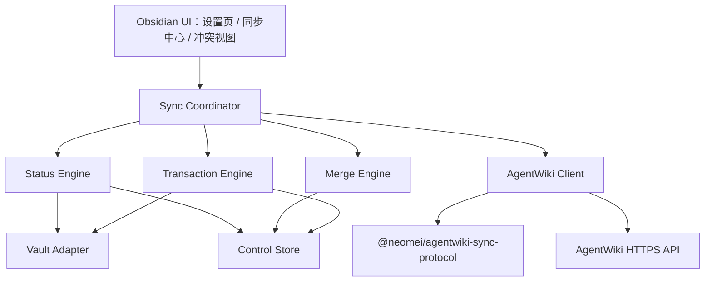

# AgentWiki Sync Obsidian 插件设计

## 文档状态

- 产品名称：`AgentWiki Sync`
- Obsidian 插件 ID：`agentwiki-sync`
- 设计确认日期：2026-08-13
- 状态：已完成对话确认与实现完整性复审，等待修订版书面 spec 复核
- 依赖契约：[`docs/contracts/agentwiki-obsidian-sync-api-v1.md`](../../contracts/agentwiki-obsidian-sync-api-v1.md)

## 1. 背景与目标

AgentWiki Sync 是独立发布、独立版本化的 Obsidian 社区插件。首版目标是让一个 Obsidian Vault 通过 AgentWiki 同步多个 Space，从而以 AgentWiki 替代传统公共 Vault 的多端共享方式。

首版交付一个可验证的手动同步闭环：

1. 用户在 Obsidian 设置页内以 AgentWiki 人类身份连接设备。
2. 一个 Vault 可以映射多个 AgentWiki Space，每个 Space 对应一个互不重叠的目录。
3. 用户通过 `Status`、`Pull`、`Push` 完成 Git 风格同步。
4. 所有本地写入和远端发布均先预览、后确认。
5. 同步同时支持 Obsidian 桌面端和移动端。

未来 Claudian 等 Agent 可以调用相同的同步用例，但不属于首版。未来 Agent 只能发起预览，不能读取设备凭据，也不能绕过 Obsidian 内的人类确认。

## 2. 首版范围

### 2.1 包含

- 一个 Vault 连接一个 AgentWiki 服务。
- 一个 Vault 映射多个 Space。
- 每个 Space 映射一个 Vault 相对目录。
- 映射目录互不相同、互不嵌套。
- 仅同步映射目录中 Obsidian Vault API 可见、扩展名按 ASCII 大小写不敏感等于 `.md` 的文件；保留实际路径大小写。
- 保留 Markdown 的嵌套相对目录结构。
- 提供设置页、功能区入口、同步中心、命令面板命令、预览和冲突解决界面。
- 提供首次绑定、Status、Pull、Push、可恢复删除、三方合并和事务回滚。
- 使用人类设备同步凭据，按当前用户和实时 Space 角色授权。
- 支持分页 Snapshot/Delta、分批上传和原子 finalize。
- 在单 Space 5,000 篇 Markdown、正文总计 100 MiB、单篇不超过 1 MiB 的基线下验收。

### 2.2 不包含

- 图片、音频、视频、PDF、Canvas 或其他二进制附件同步。
- AgentWiki Relation、Memory、Source 或附件模型同步。
- 自动检查、定时轮询、自动 Pull 或自动 Push。
- Stage、Unstage、Commit、部分文件 Push 或一键同步全部 Space。
- 在 Markdown 中写入 AgentWiki page ID、Space ID 或其他同步 frontmatter。
- 将 YAML frontmatter 解释为同步元数据；frontmatter 作为正文原样同步。
- Claudian、MCP 或其他 Agent 的实际接入。
- 在当前仓库修改 AgentWiki 主项目。
- 在首版中支持一个 Vault 连接多个 AgentWiki 服务。

## 3. 核心产品决策

### 3.1 Space 与目录

- Space 是同步、版本、事务和冲突处理的最小边界。
- 一个 Vault 可以绑定多个 Space。
- 每个 Space 绑定一个 Vault 相对目录，例如 `Knowledge/Product/`。
- `rootPath` 必须是非空目录路径；首版不允许把 Vault 根目录本身映射给 Space。
- 未映射目录完全不参与扫描和同步。
- 两个映射目录不能相同或相互嵌套。
- 映射目录不能包含 Vault 根目录的 `.agentwiki/` 控制目录。
- 首版不提供跨 Space 移动。把文件从一个映射目录移动到另一个映射目录，会在源 Space 中表现为归档、在目标 Space 中表现为新增，并分别预览确认。

### 3.2 Git 风格操作

首版采用轻量 Git 语义：

- `Status`：计算本地变化并轻量检查远端 revision head。
- `Pull`：取得远端变化、三方合并、预览并原子应用到 Vault。
- `Push`：确认远端没有领先后，预览并条件式发布本地变化。

没有暂存区和本地 commit。一个 Space 映射目录内的所有可同步变化进入该 Space 的 Push 预览。

### 3.3 页面映射

对映射目录 `Knowledge/Product/` 下的 `Guides/Setup.md`：

- AgentWiki `path`：`Guides/Setup.md`
- AgentWiki `title`：`Setup`
- AgentWiki `body`：文件的完整 Markdown 字符串
- AgentWiki `pageId`：公开、稳定且不透明的 Knowledge ID；现有页面使用 AgentWiki `Page.knowledgeKey`，本地新增页面使用 UUID v4

正文不要求首行是 H1。为避免远端 title 无法在纯 Markdown 中无损表示，title 使用以下方向性规则：

- 本地新增页面时，title 取文件名 stem。
- 本地移动但文件名未变时，只更新 path，保留 base title。
- 本地重命名文件时，title 更新为新文件名 stem。
- 远端 title-only 变化写入 manifest，不改名本地文件；后续 body-only Push 保留 manifest 中的远端 title，不用文件名覆盖它。

因此，只有本地新增或文件名变化会从文件名派生 title。移动或重命名不会生成新的 page ID。

`Page.id` 是 AgentWiki 服务端内部数据库 ID，不得出现在同步协议中。公开 `pageId` 永远映射到 `Page.knowledgeKey`。本地新增页在第一次进入 Push 预览时生成 UUID v4；该 ID 与预览一起持久化，即使取消上传、网络重试或应用重启也保持不变，直到用户删除该本地新增文件或成功建立远端基线。

AgentWiki 必须为每个 Page 保存正式的 `syncPath` 与大小写无关的 `syncPathKey`。协议中的 `path` 对应 `syncPath`，不能再临时从 title、slug 或 sourcePath 推导。详细迁移和统一 revision 规则见上游 API 契约第 4–5 节。

### 3.4 文本规范化

- 传输编码为 UTF-8。
- 计算正文 hash、比较和上传前，将 `CRLF` 和单独的 `CR` 规范化为 `LF`。
- 是否包含末尾换行属于正文内容，必须保留在比较结果中。
- 正文不做 Unicode 归一化。
- 路径分隔符统一为 `/`，路径段进行 Unicode NFC 归一化。
- 为保证跨平台恢复，Status 必须拒绝 Unicode 归一化后重复或仅大小写不同的路径碰撞。
- 禁止绝对路径、空路径段、`.`、`..`、NUL 和逃逸映射根目录的路径。
- 路径最长 1,024 个字符，标题最长 500 个字符，规范化正文最长 1 MiB。
- 目标文件路径不能已被文件夹占用，任何父路径也不能是普通文件；这些情况属于阻塞性 `invalid`。
- Pull 可以创建缺失父目录。回滚只删除本事务创建且仍为空的目录；普通空目录不参与同步，也不会因 Pull/Push 自动删除。

## 4. 架构



### 4.1 Obsidian UI 外壳

负责展示状态、收集选择和取得确认。UI 不直接发 HTTP、不直接写 Vault，也不直接修改 manifest。

### 4.2 Sync Coordinator

负责 Status、Pull、Push 和首次绑定的用例编排：

- 根据活动文件或用户选择确定 Space。
- 对同一 Space 获取排他操作锁。
- 调用状态、合并、事务和 API 端口。
- 在任何写入前生成不可变预览。
- 校验用户确认对应的预览 hash。
- 把结构化进度和错误返回 UI。

不同 Space 逻辑上彼此隔离。首版不主动并行执行多个 Space 操作。

### 4.3 Status Engine

纯 TypeScript 模块，负责：

- 比较当前文件、manifest 和 base。
- 分类新增、修改、删除、移动/重命名和身份歧义。
- 检测路径碰撞、超限文件和不支持的附件链接。
- 生成 Push 输入和 Pull 的本地分支。

### 4.4 Merge Engine

纯 TypeScript 模块，负责 page identity、路径、标题和正文的三方比较。正文使用 `node-diff3` 3.x 逐行合并。输出只包含自动合并结果和结构化冲突块，不包含写文件行为。

正文先按第 3.4 节规范化，再拆为不含 `\n` 的行数组，并单独保存 `hasFinalNewline`。正文行交给 diff3；末尾换行按一个独立布尔字段执行同样的 base/local/remote 三方规则。合并后用 `\n` 连接并按最终布尔值恢复末尾换行，确保空文件、单行文件和缺少末尾换行不会互相误判。

每个冲突块至少包含 `conflictId`、base/local/remote 行范围和三份文本；`conflictId` 是 page ID、三个范围及三份内容 hash 的 SHA-256，重新生成相同预览时保持稳定。用户的逐块选择按 conflictId 保存，只能应用到 previewHash 相同的预览。

### 4.5 Transaction Engine

负责把 Pull 计划转换为持久化事务：准备 journal、保存受影响文件快照、依序应用、推进 manifest、提交或回滚。

### 4.6 适配器

- `Vault Adapter`：仅通过 Obsidian Vault、FileManager、MetadataCache 和 Adapter API访问 Vault；不得使用 Node `fs`。
- `Control Store`：读写 `.agentwiki/` 下的 config、manifest、base 和 transaction。
- `AgentWiki Client`：通过 Obsidian 跨平台请求 API 调用公开 HTTPS API，并用稳定协议包做运行时校验。

### 4.7 公开协议包

`@neomei/agentwiki-sync-protocol` 只包含：

- 版本化 DTO 和运行时 Schema。
- 错误码。
- 规范化与 canonical serialization 规则。
- Snapshot、Delta 和 Push session 的协议类型。

协议包必须支持浏览器 ESM，不得依赖 Node 内置模块，不执行网络请求，不保存凭据。插件不得导入 AgentWiki 服务端或 `packages/local-sync` 的内部源码。

## 5. 本地状态模型

### 5.1 控制目录

```text
.agentwiki/
├── config.json
├── spaces/
│   └── <space-id>/
│       ├── manifest.json
│       ├── pending-identities.json
│       └── base/
│           └── <page-id>.md
├── transactions/
│   └── <transaction-id>/
│       ├── journal.json
│       ├── snapshots/
│       ├── results/
│       └── payload/
└── detached/
    └── <timestamp>-<space-id>/
```

`.agentwiki/` 永不进入 AgentWiki 同步 payload。所有内容只在本地 Vault 中使用。

### 5.2 `config.json`

```ts
interface AgentWikiConfigV1 {
  schemaVersion: 1;
  serverUrl: string;
  serverInstanceId: string | null;
  vaultId: string;
  credentialSecretId: string | null;
  spaces: Array<{
    spaceId: string;
    displayName: string;
    rootPath: string;
  }>;
}
```

- `serverUrl` 未配置时为空字符串；非空时必须是无用户名和密码的绝对 URL。非 loopback 地址只允许 HTTPS。
- `serverInstanceId` 来自设备会话响应，用于防止更换域名或服务器后误复用相同 Space ID。
- `vaultId` 是该 Vault 的随机 UUID，不是凭据。
- `credentialSecretId` 只是 Obsidian Secret Storage 中条目的引用名。
- Secret ID 固定格式为 `agentwiki-sync-<server-instance-id>-<device-id>` 的小写字母、数字和连字符；UUID 中的连字符保留。
- 真正的设备凭据只存 Secret Storage。
- `deviceId` 使用 Obsidian vault-local local storage 保存，不进入 `.agentwiki/`，确保每台设备独立连接。

### 5.3 `manifest.json`

```ts
interface SpaceManifestV1 {
  schemaVersion: 1;
  protocolVersion: "1";
  spaceId: string;
  rootPath: string;
  baseRevision: string;
  lastSuccessfulSyncAt: string;
  pages: Record<string, {
    pageId: string;
    relativePath: string;
    title: string;
    contentHash: string;
  }>;
}
```

manifest 只在成功建立基线或成功完成 Pull/Push 后整体替换。临时或部分执行结果不得写入有效 manifest。

`pages` 以 `pageId` 为 key。服务端 `updatedAt` 不属于同步正确性条件，不保存到 manifest；并发控制只使用 Space `baseRevision` 和本地内容 hash。

加载 manifest 时必须执行运行时 Schema 校验，并验证 space ID、rootPath、page ID 唯一性、relativePath/pathKey 唯一性，以及每个 `base/<page-id>.md` 的规范化 hash 等于 manifest contentHash。任一失败都把 Space 标记为 `baseline_corrupt` 并禁止 Push；不能跳过坏条目继续运行。

### 5.4 `base/`

`base/<page-id>.md` 保存对应 manifest 的共同基线正文，用于真正的 diff3。路径和标题在 manifest 中保存，因此页面移动不需要移动 base 文件。

### 5.5 重命名识别

重命名识别按以下优先级进行：

1. 插件运行期间监听到 Obsidian `rename` 事件时，记录原 page ID 到新路径的本地 move hint。
2. 事件缺失时，使用消失页面的 base hash 与新增路径的正文 hash 做唯一精确匹配。
3. 同一 hash 对应多个候选，或文件同时重命名和修改而没有 move hint 时，标记“身份需确认”。

不得使用内容相似度自动猜测 page identity。用户确认身份后，选择结果进入当前预览，不在确认前改写 manifest。

### 5.6 事务日志

事务 journal 使用 `kind: "pull_apply" | "push_upload"`。Pull journal 状态为：

- `prepared`
- `applying`
- `committing`
- `committed`
- `rolling_back`
- `failed`

快照记录受影响路径在事务前是否存在及其完整字节内容。插件启动和每个写操作前检查未清理事务：

- `prepared`、`applying`、`committing`：执行回滚。
- `committed`：完成安全清理。
- `rolling_back`：继续回滚。
- `failed`：冻结对应 Space，等待用户查看诊断并人工恢复。

Push journal 状态为：

- `uploading`
- `ready_to_finalize`
- `finalizing`
- `published`
- `aborted`
- `expired`

Push journal 保存 base revision、不可变确认 manifest、idempotency key、远端 session ID、已确认批次 receipt，以及 `payload/<page-id>.md` 中用户确认时的规范化正文快照；不保存设备凭据。插件启动时不自动联网恢复 Push；用户下次打开同步中心时，插件查询 session 状态并显示“继续上传”“重新确认并 finalize”或“丢弃”。`finalizing` 状态必须先查询服务端结果，不能假定请求失败，也不能创建不同 payload 的新 session。

成功或明确 abort 后删除 payload；未知结果、离线或查询失败时必须保留。服务端已发布时，以 journal 中的确认快照而不是当前 Vault 内容推进 base；用户在确认后的新编辑因此仍会被 Status 判定为 `modified`。

### 5.7 Pull journal Schema 与条件写入

```ts
interface PullJournalV1 {
  schemaVersion: 1;
  kind: "pull_apply";
  transactionId: string;
  spaceId: string;
  fromRevision: string;
  toRevision: string;
  previewHash: string;
  state: "prepared" | "applying" | "committing" | "committed" | "rolling_back" | "failed";
  nextActionIndex: number;
  actions: PullActionV1[];
  failure?: { code: string; actionIndex: number; path?: string };
}

type PullActionV1 =
  | {
      kind: "create";
      path: string;
      expected: { exists: false };
      resultContentHash: string;
    }
  | {
      kind: "write";
      path: string;
      expected: { exists: true; contentHash: string };
      resultContentHash: string;
    }
  | {
      kind: "rename";
      fromPath: string;
      toPath: string;
      expected: { fromExists: true; fromContentHash: string; toExists: false };
      resultContentHash: string;
    }
  | {
      kind: "trash";
      path: string;
      expected: { exists: true; contentHash: string };
    };
```

`rename` 是复合动作：以 expected 验证源和目标后，把 `results/` 中的最终正文写入目标路径并移除源路径；因此它同时覆盖“移动且正文被合并”的情形，不是假设正文保持不变。创建/写入/rename 的结果正文都必须能由 `results/` 按 action index 找到。

`previewHash` 是 `{ schemaVersion: 1, spaceId, fromRevision, toRevision, actions }` 的 canonical UTF-8 bytes SHA-256；action 按最终目标路径、kind、源路径排序，且包含 expected 与 result hash。UI 的确认对象同时保存该 hash；确认 hash 与 journal 不一致时禁止应用。

每个 action 的结果正文保存在事务目录的 `results/`，操作前原始正文保存在 `snapshots/`。journal、snapshot 和 result 全部写完并重新读取校验后，状态才能从 `prepared` 进入 `applying`。

条件写入规则：

1. 预览确认时记录每个受影响路径的 `expected`。
2. 进入事务前重新扫描全部 expected；任一不匹配则不创建 `applying` 状态，废弃预览。
3. 每个 action 执行前再次验证自己的 expected。修改已有文件优先使用 Obsidian `Vault.process()` 在同一读改写操作中比较当前 hash；其他动作由 Vault Adapter 执行最接近的条件操作。
4. 每次插件写入后记录 `resultContentHash`，并在 action 完成后重新读取验证。
5. 所有 Vault action 成功后，再以临时文件 + rename 方式替换 base 与 manifest，并进入 `committing`。
6. 最后重新扫描全部预期结果；全部一致才进入 `committed`。

如果预览后用户继续编辑，步骤 2 或 3 必须中止并要求重新 Pull，不能覆盖新编辑。如果用户在插件写入后又修改同一文件，回滚只在当前内容仍等于插件记录的 `resultContentHash` 时自动恢复；否则 journal 进入 `failed` 并冻结 Space，避免回滚再次覆盖用户的新内容。

回滚按已完成 action 的逆序执行：create 删除插件创建的文件；write 从 snapshot 恢复；rename 移回原路径；trash 使用 snapshot 在原路径重建。已经进入 Obsidian 或系统回收站的副本可能保留，但活动 Vault 必须恢复到事务前内容。控制文件替换保留 `.prev`，恢复时根据 journal 选择旧 manifest/base；不依赖底层 rename 具备操作系统级原子性。

### 5.8 Push journal Schema

```ts
interface PushJournalV1 {
  schemaVersion: 1;
  kind: "push_upload";
  transactionId: string;
  spaceId: string;
  baseRevision: string;
  previewHash: string;
  confirmationManifest: PushConfirmationManifestV1;
  confirmationHash: string;
  idempotencyKey: string;
  state: "uploading" | "ready_to_finalize" | "finalizing" | "published" | "aborted" | "expired";
  sessionId: string | null;
  sessionExpiresAt: string | null;
  uploadedBatches: Array<{ batchIndex: number; batchHash: string; receipt: string }>;
  publishedRevision: string | null;
}
```

Push 预览确认后先持久化 journal 与 payload，再创建远端 session。每个 upsert 的正文必须能由 `payload/<page-id>.md` 和 confirmation manifest 完整重建。只有成功查询到 `published` 或成功收到 finalize 响应后，才可用这些快照更新 base 与 manifest。

## 6. 身份、连接与权限

### 6.1 设置页内联连接

设置页依序显示：

1. AgentWiki 服务地址。
2. 一次性 Obsidian 连接码输入框。
3. `连接` 按钮和原地验证状态。
4. 连接成功后原地展开 Space 目录映射。

插件不自动打开浏览器、不弹出多步向导。用户可主动点击帮助链接或 AgentWiki 地址。

交换成功后的落盘顺序固定为：把 credential 写入 Secret Storage；立即读取比对；用该 credential 查询设备 session；最后才写 config 中的 secret ID、serverInstanceId 和连接状态。任一步失败都不保存“已连接”状态。Secret Storage 写入/校验失败时，插件必须用仍在内存中的 credential 请求撤销；撤销也失败时只显示 credential ID 和 AgentWiki Web 撤销指引，绝不显示或记录明文 credential。

### 6.2 人类设备凭据

- 安装码只在交换请求期间存在内存，交换结束立即清除输入状态。
- 换取的凭据代表创建安装码的人类用户，而不是 Agent。
- 每台设备独立交换、独立撤销、独立审计。
- 每次请求重新检查用户有效状态。
- 每个 Space 操作重新检查实时角色。
- `viewer` 可 Status/Pull，不可 Push。
- `editor`、`admin`、`owner` 可在 Obsidian 内确认后直接发布。
- 设备凭据只允许 Obsidian 同步 API，不允许成员、Agent、凭据或审核管理。

完整服务端契约见 `docs/contracts/agentwiki-obsidian-sync-api-v1.md`。

## 7. Status

1. 活动文件位于某个映射目录时，默认选择该 Space；否则显示 Space 选择器。
2. 扫描该映射目录的可见 Markdown。
3. 与 manifest 和 base 比较，产生本地状态。
4. 请求远端 revision head，不下载正文。
5. 显示本地变化、远端是否领先、附件链接警告和阻塞错误。

附件链接警告通过 Obsidian MetadataCache 中已解析的 embeds/links 加原始 Markdown 链接扫描生成：目标不是同一映射目录内 `.md` 的链接标记为“不随 AgentWiki 同步”。警告不阻止同步，也不读取或上传附件内容；代码块中的文本不作为链接扫描 fallback 的命中。

状态分类：

- `clean`
- `added`
- `modified`
- `deleted`
- `renamed`
- `identity_required`
- `invalid`

离线或请求失败时仍显示本地分类，远端状态显示 `unknown`。Status 永不修改 Vault、manifest、base 或服务端。

## 8. Pull

### 8.1 常规 Pull

1. 获取 Space 操作锁。
2. 恢复或冻结未完成事务。
3. 从 `baseRevision` 分页获取 Delta；服务端无法提供该历史 revision 时获取固定 revision 的分页 Snapshot。
4. 构造 base、local、remote 三个分支。
5. 按 page ID 合并路径、标题和正文。
6. 非重叠正文改动自动合并；冲突转换为结构化冲突块。
7. 展示新增、修改、移动、回收站删除和冲突解决后的最终预览。
8. 用户确认后记录每个受影响路径的 expected hash，并生成 journal、结果文件和原始文件快照。
9. 事务开始前重新验证全部 expected；不匹配则废弃预览，不写入 Vault。
10. 使用条件写入应用全部 Vault 变化。
11. 写入新的 base 和 manifest，并验证最终文件 hash。
12. 标记 committed 并清理事务。

这是应用层原子性，不宣称操作系统级原子写入。

### 8.2 冲突条件

- 同一正文区间被两端修改。
- 一端删除、另一端修改。
- 同一页面被两端移动到不同路径。
- 多个页面最终占用同一路径。
- 本地 page identity 无法唯一判定。
- 两台设备基于同一 base 独立新增相同路径但产生不同 page ID。

存在任何未解决冲突时，不修改任何文件。相同路径的并发新增解决后必须保留一个 page ID；远端已存在 page ID 时优先沿用远端 ID，本地临时 ID 被丢弃。

路径和标题按字段独立做三方合并：

| Base → Local | Base → Remote | 结果 |
|---|---|---|
| 不变 | 不变 | Base |
| 改变 | 不变 | Local |
| 不变 | 改变 | Remote |
| 改成相同值 | 改成相同值 | 该新值 |
| 改成不同值 | 改成不同值 | 字段冲突 |
| 删除页面 | 任意修改 | 删除/修改冲突 |

正文使用相同原则，但“改成不同值”先交给逐行 diff3：非重叠区间自动合并，重叠区间才产生正文冲突。字段冲突、正文冲突和最终路径碰撞全部解决后，才产生可确认的 Pull 计划。

### 8.3 删除

远端归档经 Pull 预览确认后，通过 Obsidian 回收站 API 移除本地文件。回收站操作失败会使整个 Pull 事务失败并回滚。

## 9. Push

1. 获取 Space 操作锁。
2. 计算本地变化并请求远端 revision head。
3. 远端领先或状态未知时禁止 Push，要求先 Pull。
4. 验证路径、正文大小、身份和协议限制。
5. 展示新增、修改、移动、归档和附件链接警告。
6. 以确认时的不可变内容快照计算 `confirmationHash` 和幂等键。
7. 建立 push session，并按服务端能力限制分批上传变更。
8. 所有批次完成后，携带 `baseRevision` 和 `confirmationHash` 执行原子 finalize。
9. 服务端重新检查用户、角色、base revision、批次 hash 和完整 payload hash。
10. 成功后用已确认快照更新 base 和 manifest revision。

本地删除在 Push payload 中表示 AgentWiki 页面归档，不执行物理删除。

用户可能在网络请求期间继续编辑。远端发布的是用户确认时的快照；发布成功后 base 也更新为该快照，之后的新编辑仍留在 Vault，并在下一次 Status 中显示为 `modified`。

服务端 finalize 返回 `BASE_STALE` 时不推进本地基线。网络重试复用幂等键；相同幂等键和相同 payload 返回原结果，相同幂等键和不同 payload 返回错误。

Push 上传和 finalize 状态写入 `kind: "push_upload"` 的本地 journal。finalize 响应丢失时，下次用户主动打开同步中心后查询同一 session；服务端已发布则按 journal 中的原确认快照推进 base，未发布则允许以同一 idempotency key 安全重试。成功响应的 `revisionContentHash` 必须与随后由本地确认快照重建的 manifest hash 一致，否则不推进本地基线并要求重新 Pull。

## 10. 首次绑定

首次绑定不假设共同基线：

- 本地空、远端有内容：显示 Clone 预览，确认后按 Pull 事务写入。
- 本地有内容、远端空：显示发布预览，确认后为每页生成 page ID 并按 Push session 发布。
- 两边都有内容：按规范化相对路径形成首次合并候选；同路径不同正文必须解决，确认后才创建共同 base。
- 两边都空：直接记录当前远端 revision 为空基线。

首次绑定失败或取消不得写入有效 manifest。换设备没有控制目录时，重新获取远端 Snapshot 并进入同一首次绑定流程。

首次绑定逐路径使用以下真值表：

| 本地 | 远端 | 默认提案 |
|---|---|---|
| 不存在 | 存在 | 创建本地文件并采用远端 page ID/title/body |
| 存在 | 不存在 | 生成稳定本地 UUID，提案为远端新增 |
| 存在 | 存在，规范化正文相同 | 绑定远端 page ID；远端 title 写入 manifest，不改本地文件名 |
| 存在 | 存在，正文不同 | 冲突；Base 为空，只允许用户选择 Local、Remote 或手工最终正文 |
| 多个本地路径经 NFC/大小写折叠后相同 | 任意 | 阻塞，必须先在 Vault 中改名 |
| 任意 | 多个远端 pathKey 相同 | 协议错误，禁止建立基线 |

首次绑定没有共同 Base，因此不得自动把两份不同正文做 diff3。远端相同 page ID 但不同 path 以远端 path 为准；两个不同 page ID 占用同一路径时，用户必须选定一个保留的 page ID。远端 page ID 优先；本地临时 ID 只有在最终选择发布本地为新页面时保留。

新增 page ID 在第一次展示 Push/首次绑定预览前生成，并写入 `.agentwiki/spaces/<space-id>/pending-identities.json`：

```ts
interface PendingIdentityV1 {
  schemaVersion: 1;
  items: Array<{ relativePath: string; contentHashAtCreation: string; pageId: string }>;
}
```

同一路径和同一内容的重试复用 page ID；文件删除后清除；路径或内容变化时保留原 ID并更新 pending 记录，除非用户明确选择“作为另一新页面”。成功同步后记录移入 manifest。

### 10.1 映射和连接配置迁移

- 添加映射：目标目录与其他映射互斥后进入首次绑定，不得直接创建有效 manifest。目标目录不存在时在确认首次绑定后创建；失败时可留下空目录，但不得留下有效 manifest。
- 移除映射：要求没有活动事务；只移除 active mapping，不删除 Markdown。manifest/base 移到 `.agentwiki/detached/<timestamp>-<space-id>/`，用户可手动清理。
- 更改已绑定目录：首版不支持原地改 rootPath。用户必须先在 clean 且远端 head 等于 base 时移除映射，再添加新目录并重新首次绑定。
- 断开设备：撤销成功后用 `SecretStorage.setSecret(secretId, "")` 覆写本地值，再清除 config 中的引用；Obsidian 1.11.5 API 没有插件级 deleteSecret。保留 Markdown 和控制状态，所有 Space 显示 disconnected。
- 离线断开：只能用空字符串覆写并在本地忘记凭据，必须明确警告远端凭据仍需稍后在 AgentWiki Web 撤销。
- 切换服务地址：只有无活动事务且已断开时允许。服务端 session 返回稳定 `serverInstanceId`；新地址的 instance ID 不同则所有旧映射保持 detached，不能按相同 Space ID 自动复用。
- Space 重命名：只更新显示名，不影响 space ID、目录或基线。

## 11. 用户界面

### 11.1 同步入口

- 功能区图标打开轻量同步中心模态框。
- 命令面板注册 `AgentWiki: Status`、`AgentWiki: Pull`、`AgentWiki: Push`。
- 活动文件可确定 Space 时直接使用该 Space，否则显示选择器。
- 同步中心始终允许明确选择一个 Space。
- 首版不提供 `Push All` 或 `Pull All`。

### 11.2 同步中心

每个 Space 显示：

- 显示名和映射目录。
- 当前角色与读写能力。
- base revision。
- 本地新增、修改、删除和移动数量。
- 远端状态：一致、领先或未知。
- 当前操作、进度和可执行动作。

### 11.3 预览与取消

所有写操作必须显示文件级摘要和最终动作。扫描、下载、合并、上传阶段允许取消；Pull 开始事务写入后，以及 Push 开始 finalize 后，不允许用户中断，界面必须解释当前原子阶段。

### 11.4 冲突视图

- 桌面端并排显示 Base、Local、Remote。
- 移动端使用 Base、Local、Remote 标签页。
- 每个冲突块可以选择 Local、Remote 或直接编辑最终结果。
- 用户必须查看完整合并结果后才能确认。
- 不把 Git 冲突标记写入 Markdown。

## 12. 后台行为

首版严格手动：

- 插件加载时不发起远端请求。
- 文件事件只使本地状态缓存失效，并记录可靠的 rename hint。
- 只有打开同步中心或执行 Status/Pull/Push 才访问网络。
- 不注册定时轮询。
- 不在 Obsidian 启动或获得焦点时自动检查。

## 13. 错误处理与恢复

- 网络失败：不推进 manifest；Pull 不写文件；Push 保留可重试预览或上传会话信息。
- 权限撤销：停止当前操作并刷新该 Space 能力，不影响其他 Space 配置。
- `BASE_STALE`：停止 Push 并提示先 Pull。
- 协议不兼容：禁止同步，只显示诊断和升级建议。
- 控制目录损坏或 base 缺失：禁止 Push，通过首次绑定预览重新建立基线。
- Pull 应用失败或应用退出：下次启动根据 journal 回滚。
- 回滚失败：标记 `failed` 并冻结该 Space，同步操作不得继续覆盖。
- 同一 Space 的并发操作：第二个操作立即拒绝并显示正在进行的动作。
- 远端分页 cursor 失效：放弃当前预览并从固定 revision 重新请求，不混用两次分页结果。
- Push session 过期：重新检查 head、重新生成预览并取得确认；不得仅重建上传 session 后静默 finalize。
- finalize 响应丢失：保留 `finalizing` journal；下次用户主动操作时查询 session 状态，禁止猜测发布结果。

## 14. 诊断与隐私

诊断允许包含：

- 插件、Obsidian 和协议版本。
- Space ID、revision ID、事务 ID 和错误码。
- 文件相对路径、大小和内容 hash。
- 事务阶段、批次索引和 HTTP 状态码。

诊断默认禁止包含：

- Markdown 正文或 diff 内容。
- 安装码、设备凭据或 Secret Storage 值。
- Authorization、Cookie 或完整请求头。
- 未脱敏服务端响应正文。

复制诊断前必须展示最终文本预览。

## 15. 技术基线

- TypeScript 严格模式。
- Obsidian 原生 UI 组件，不引入 React。
- esbuild 生成单一插件运行时 bundle。
- Vitest 运行纯核心和适配器契约测试。
- `node-diff3` 3.x 提供浏览器兼容三方合并。
- Node.js 24 LTS 仅用于开发和 CI。
- npm lockfile 固定依赖树。
- `manifest.json` 设置 `minAppVersion: "1.11.5"`、`isDesktopOnly: false`。
- 运行时禁止 Node 内置模块、Shell、本地服务、daemon 和桌面专属文件系统 API。

## 16. 资源预算与有界处理

- Snapshot/Delta 每个 HTTP 响应同时受 `maxPageItems` 和 `maxResponseBytes` 限制，默认请求不超过 200 项且响应不超过 4 MiB；单个 1 MiB 页面必须能单独成页。
- Push 每批默认不超过 100 项且完整 HTTP body 不超过 4 MiB；以服务端返回的更小 capability 为准。
- 网络、hash、合并和 Vault 写入并发度首版固定为 1；不得把 100 MiB Space 的全部正文拼成一个内存数组或 JSON 字符串。
- Status 可以在内存保留 5,000 条元数据，但正文逐文件读取、hash 后立即释放。
- Pull 逐页落到事务 `results/`，Push 逐页落到 `payload/`；UI 只加载当前预览或冲突文件。
- 移动端目标是插件同步核心额外峰值 heap 不超过 32 MiB，不含 Obsidian 自身和当前编辑器正文；性能测试通过采样验证。
- Obsidian 没有跨平台剩余磁盘空间 API。写事务前计算 `estimatedTemporaryBytes = resultBytes + snapshotBytes + newBaseBytes + 10%` 并展示；无法保证剩余空间时必须明确提示。任一 `ENOSPC`/写入失败按事务恢复规则处理。
- Pull 和 Push 每处理一批或 50 个本地文件（取先到者）向事件循环让步并更新进度，移动端 UI 不得长时间无响应。

## 17. 验证策略

### 17.1 单元测试

- 路径规范化、非法路径、Unicode/大小写碰撞和目录重叠。
- 状态分类和 rename hint/hash fallback/身份歧义。
- LF 规范化、hash、canonical serialization 和 confirmation hash。
- diff3 非重叠合并、重叠冲突、删除/修改和双向移动。
- 首次 Clone、本地首次发布和首次双方合并。
- 首次绑定完整真值表、pending identity 在取消/重启/重试中的稳定性。
- path/title 字段合并真值表及 title-only 远端变化。
- 权限能力映射和错误码到 UI 状态的转换。
- 诊断脱敏。

### 17.2 适配器与故障注入测试

- 使用内存 Vault 和 fake HTTP 实现测试端口契约。
- 在每个 Pull journal 阶段注入异常，验证回滚或冻结结果。
- 预览后、事务开始前、每个 action 前和插件写入后注入用户编辑，验证条件写入不会覆盖新内容。
- 验证 manifest 临时替换损坏、`.prev` 恢复、回滚逆序和回收站残留语义。
- 验证回收站失败、控制目录损坏、分页 cursor 失效和 push session 过期。
- 验证 Push journal 保存确认正文、finalize 响应丢失后以确认快照推进 base。
- 验证 Secret 从不进入普通设置、控制目录和日志。
- 验证插件加载、文件事件和闲置状态不产生网络请求。
- 验证添加/移除映射、断开、离线忘记凭据和 serverInstanceId 变化。

### 17.3 API 契约测试

- 协议包同时验证插件请求、服务端响应和错误 envelope。
- 分页 Snapshot/Delta 固定 revision，不混入后续发布。
- 分批上传支持相同批次幂等重试，拒绝同索引不同 hash。
- finalize 原子检查 base、确认 hash、用户状态和实时角色。
- AgentCredential 无法调用人类设备直接发布路径。
- 所有 AgentWiki Page 写入口推进统一 revision，公开 pageId/path 与服务端字段映射固定。
- 固定 hash fixture、批次完整 HTTP byte 计数和双限制分页。

### 17.4 端到端验收

使用独立测试 Vault 和本地 AgentWiki：

1. 一个 Vault 映射两个互不重叠 Space，操作和失败完全隔离。
2. 桌面 Push 后移动端 Pull，再由移动端 Push、桌面 Pull。
3. 两设备修改不同段落后自动合并。
4. 两设备修改同一区间后在 Obsidian 内解决冲突。
5. 远端归档进入本地回收站，本地删除发布为远端归档。
6. Push 期间角色降为 viewer，服务端拒绝且本地 base 不推进。
7. Pull 应用中断后，下次启动恢复到事务前状态。
8. 5,000 篇、100 MiB 的 Space 完成分页 Pull、Status 和分批 Push；界面持续显示进度且保持可交互。
9. Pull 预览期间继续编辑受影响文件，确认时安全失效且不覆盖新编辑。
10. finalize 成功但响应丢失，重启后查询 session 并以确认快照恢复正确 base，同时保留之后的新编辑。

### 17.5 持续集成门禁

- 格式检查。
- ESLint。
- TypeScript typecheck。
- Vitest 全量测试。
- 生产构建。
- 构建产物扫描，禁止 Node 内置模块和意外凭据模式。
- `manifest.json`、版本映射文件和发布产物一致性检查。

## 18. 实施依赖与顺序

本设计包含两个仓库边界明确的交付物：

1. AgentWiki 主项目独立任务：实现并发布人类设备身份、同步 API v1 和浏览器兼容协议包。
2. 当前插件项目后续任务：基于已发布契约实现 AgentWiki Sync。

主项目在当前任务中保持只读。插件可以先针对 fake client 开发纯核心和 UI，但真实端到端验收必须使用已发布的公共契约，不得复制主项目内部 DTO 作为临时替代。
